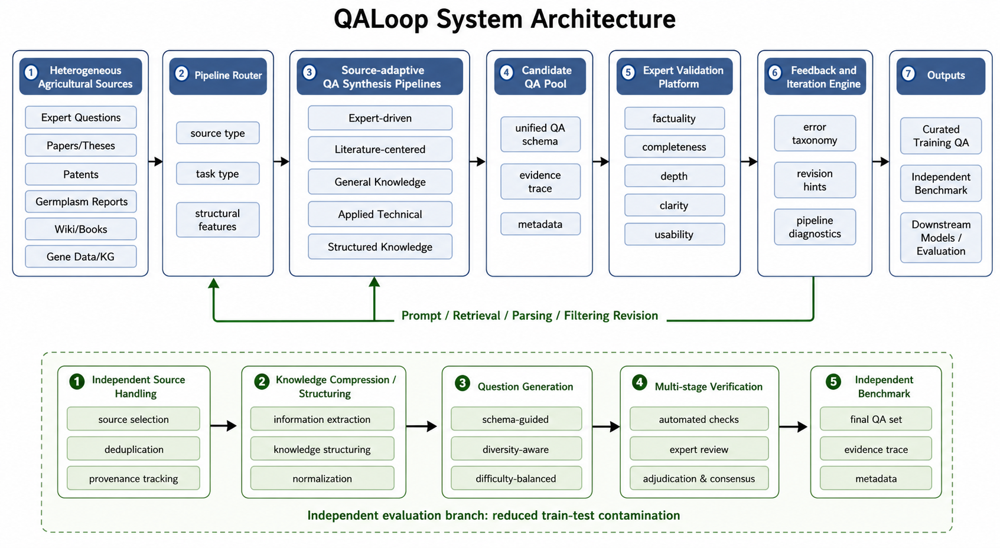

# QALoop

**A Human-in-the-Loop Framework for Large-scale Agricultural QA Construction and Evaluation**

Official code release for our ICDM paper. QALoop operationalizes agricultural QA data production as a **closed-loop system**: heterogeneous sources are routed to source-adaptive synthesis pipelines, expert-validated through a collaborative annotation platform, revised via structured feedback, and evaluated with an independent benchmark.

In a plant breeding case study, QALoop produced **245,958 QA records** across seven production-scale pipelines, built a **1,434-question independent benchmark**, and supported comparison of **11 LLMs** with expert-scored outputs. Iterative expert feedback improved multiple pipelines; downstream full-parameter SFT of Qwen3-8B raised the plant-breeding benchmark average from **84.58 to 88.17**.

## System Architecture



The diagram above shows the end-to-end QALoop workflow: heterogeneous agricultural sources are routed through source-adaptive QA synthesis pipelines into a candidate QA pool, then validated on the **Expert Validation Platform** (`platform/`). A feedback and iteration engine closes the loop; outputs include curated training QA, an independent benchmark, and downstream model evaluation.

## Project Structure

```
QALoop/
├── platform/      # Annotation and evaluation platform (FastAPI web app)
├── pipelines/     # QA generation pipeline collection
├── data/          # Local data storage (SQLite database, gitignored)
└── LICENSE
```

## Modules

### platform/ — Annotation and Evaluation Platform

A multi-user collaborative annotation platform built on FastAPI. It supports project and dataset management, flexible annotation configurations (rating, classification, text, single/multi-select, binary), statistical analysis, and export. Optionally integrates LLM-based intelligent analysis of annotation notes.

See [platform/README.md](platform/README.md) for details.

### pipelines/ — QA Generation Pipelines

A collection of standalone QA data generation pipelines. Each pipeline generates QA pairs from a specific data source. Each pipeline directory contains its own README, examples, and documentation.

See [pipelines/README.md](pipelines/README.md) for details.

## What's Released

This repository focuses on **reusable framework code**, not unrestricted release of all production data:

| Included | Description |
|----------|-------------|
| `platform/` | Expert validation & annotation platform (FastAPI) |
| `pipelines/` | 11 source-adaptive QA synthesis pipelines with minimal runnable examples |
| Documentation | READMEs, configuration guides, and deployment instructions |

Production-scale datasets and the full independent benchmark from the paper are **not** included in this release. See the paper for data availability details.

## Citation

If you use QALoop in your research, please cite:

```bibtex
@inproceedings{kuo2026qaloop,
  title={QALoop: A Human-in-the-Loop Framework for Large-scale Agricultural QA Construction and Evaluation},
  author={...},
  booktitle={IEEE International Conference on Data Mining (ICDM)},
  year={2026}
}
```

> Author list and BibTeX will be updated upon publication.

## Quick Start

### Launch the Annotation Platform

```bash
cd platform

# Install dependencies
uv sync

# Configure environment variables
cp .env.example .env
# Edit .env and update SECRET_KEY

# Create superuser
python scripts/create_superuser.py

# Start the server
uvicorn qa_annotate.main:app --reload --host 0.0.0.0 --port 8000
```

See [platform/README.md](platform/README.md) for details.

## Requirements

- Python >= 3.12
- [uv](https://docs.astral.sh/uv/)

## License

MIT
