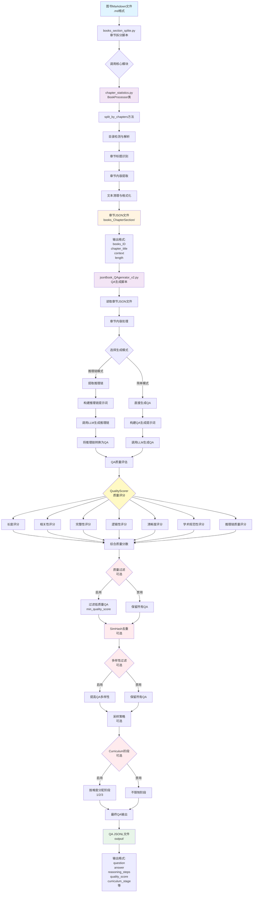

# 图书章节拆分与QA生成工具使用说明

本工具集用于处理图书文件，先按目录进行章节拆分，然后生成问答对（QA）用于模型训练。

## 工具概述

本工具集包含三个主要脚本：

1. **`chapter_statistics.py`** - 章节统计模块，提供章节拆分核心功能
2. **`books_section_splite.py`** - 章节拆分脚本，调用`chapter_statistics.py`进行章节拆分
3. **`jsonBook_QAgenrator_v2.py`** - QA生成脚本，基于拆分后的章节生成问答对

## 核心创新点

### 1. 目录结构感知章节拆分

传统方法按字符数或固定长度切分，导致章节内容不完整。本工具基于 Markdown 目录结构（`#`、`##`、`###` 等标题标记）智能识别章节边界：

```
图书 Markdown
    ↓ 检测目录标记
识别章节层级结构
    ↓ 按标题切分
保留完整章节内容
```

- **层级保留**：支持多级标题（章/节/小节）
- **标题提取**：自动识别章节标题和层级关系
- **上下文完整**：确保每个章节内容连续完整

### 2. 图书专用问答模板

针对教科书类图书设计了专门的问答生成模板：

| 模板类型 | 适用场景 | 示例 |
|---------|---------|------|
| 事实性问答 | 概念定义、数据指标 | 水稻亩产量是多少？ |
| 原理性问答 | 机制解释、因果关系 | 光合作用如何影响作物产量？ |
| 方法性问答 | 操作步骤、技术要点 | 如何进行水稻旱育秧？ |
| 比较性问答 | 差异对比、优劣势分析 | 籼稻与粳稻有何区别？ |

### 3. 层次化质量控制

```
┌─────────────────────────────────────┐
│           章节级质量控制              │
│  长度过滤、格式验证、重复检测         │
├─────────────────────────────────────┤
│           段落级质量控制              │
│  内容密度评估、主题相关性判断          │
├─────────────────────────────────────┤
│           问答级质量控制              │
│  多维度评分（长度/相关性/完整性...）  │
└─────────────────────────────────────┘
```

- **长度评分**：评估问答长度是否适中
- **相关性评分**：判断问答与原文的相关程度
- **完整性评分**：检查答案是否完整回答问题
- **逻辑性评分**：验证问答的逻辑连贯性

### 4. SimHash 高效去重

针对海量图书内容（可达数十万章节），采用 SimHash 算法实现高效相似度去重：

| 特性 | 说明 |
|------|------|
| 算法 | SimHash + Hamming 距离 |
| 阈值 | 可配置（默认 6，越小越严格） |
| 效率 | O(n) 时间复杂度 |
| 效果 | 有效去除表达相近的重复问答 |

### 5. Curriculum Stage 自动分配

根据问答的难度自动分配训练阶段，实现课程的渐进式学习：

| 阶段 | 难度 | 特征 |
|------|------|------|
| Stage 1 | 基础 | 单一事实、简单问答 |
| Stage 2 | 中级 | 多知识点关联、解释性问答 |
| Stage 3 | 高级 | 复杂推理、综合分析 |

### 6. 多维度质量过滤

```bash
# 启用完整质量过滤流程
python jsonBook_QAgenrator_v2.py \
    --enable-quality-filter \
    --min-quality-score 75.0 \
    --enable-diversity-filter \
    --simhash-dedup-hamming 5
```

- **质量阈值过滤**：可设置最小质量分数阈值
- **多样性过滤**：避免相似问答重复生成
- **可组合使用**：各过滤步骤可独立启用/禁用

## 工作流程

```
图书Markdown文件
    ↓
[步骤1] books_section_splite.py (调用 chapter_statistics.py)
    ↓
章节拆分后的JSON文件 (输出到 books_ChapterSection/)
    ↓
[步骤2] jsonBook_QAgenrator_v2.py
    ↓
QA问答对JSON文件 (输出到 output/)
```

## 安装依赖

```bash
# 使用 uv 安装依赖（推荐）
uv sync

# 或使用 pip
pip install -r requirements.txt
```

## 使用步骤

### 步骤1：章节拆分

使用 `books_section_splite.py` 脚本将图书按照目录结构进行章节拆分。

#### 基本用法

```bash
# 方式1：处理单个文件（通过命令行参数指定）
python books_section_splite.py /path/to/book.md

# 方式2：处理多个文件
python books_section_splite.py /path/to/book1.md /path/to/book2.md

# 方式3：使用默认输入文件（如果脚本中有配置）
python books_section_splite.py
```

#### 输入说明

- **输入格式**：Markdown文件（.md）
- **输入来源**：
  - 命令行参数指定的文件路径
  - 或脚本中配置的默认文件路径

#### 输出说明

- **输出目录**：`./books_ChapterSection/`
- **输出格式**：JSON文件（JSONL格式，每行一个JSON对象）
- **输出内容**：每个章节包含以下字段：
  ```json
  {
    "books_ID": "图书ID（文件名）",
    "chapter_title": "章节标题",
    "context": "章节文本内容",
    "length": 章节长度（字符数）
  }
  ```

#### 工作原理

`books_section_splite.py` 脚本会：
1. 读取输入的Markdown文件
2. 调用 `chapter_statistics.py` 中的 `BookProcessor` 类
3. 使用 `split_by_chapters()` 方法识别和拆分章节
4. 将每个章节保存为JSON格式

### 步骤2：生成QA问答对

使用 `jsonBook_QAgenrator_v2.py` 脚本基于拆分后的章节生成问答对。

#### 使用示例数据快速测试

```bash
uv run python jsonBook_QAgenrator_v2.py --input examples/sample_books.jsonl --output output/
```

#### 基本用法

```bash
# 使用默认输入目录（books_ChapterSection/）
python jsonBook_QAgenrator_v2.py

# 指定输入目录
python jsonBook_QAgenrator_v2.py --input /path/to/books_ChapterSection

# 指定输入和输出路径
python jsonBook_QAgenrator_v2.py --input /path/to/input --output /path/to/output.jsonl

# 指定目标图书ID（只处理特定图书）
python jsonBook_QAgenrator_v2.py --target-ids 9787040599398 9787040470406
```

#### 主要参数说明

| 参数 | 类型 | 默认值 | 说明 |
|------|------|--------|------|
| `--input` | str | `books_ChapterSection/` | 输入路径：可为JSONL文件或包含多个JSON/JSONL的目录 |
| `--output` | str | 自动生成 | 输出JSONL文件路径（不指定时自动生成到`output/`目录） |
| `--model` | str | None | 使用的模型名称 |
| `--max-q-per-chunk` | int | None | 每章节最大问答数 |
| `--target-ids` | list | [] | 目标图书ID列表（只处理指定的图书） |
| `--sample-strategy` | flag | False | 使用采样策略 |
| `--max-curriculum-stage` | int | None | curriculum最大阶段（1/2/3，None表示不限制） |
| `--enable-quality-filter` | flag | False | 启用质量过滤 |
| `--min-quality-score` | float | 60.0 | 最小质量分数阈值 |
| `--enable-diversity-filter` | flag | False | 启用多样性过滤 |
| `--simhash-dedup-hamming` | int | 6 | SimHash去重阈值（越小越严格） |

#### 输入说明

- **输入格式**：JSON或JSONL文件
- **输入目录**：`books_ChapterSection/`（步骤1的输出目录）
- **输入内容**：包含 `books_ID`、`chapter_title`、`context`、`length` 字段的JSON对象

#### 输出说明

- **输出目录**：`output/`
- **输出格式**：JSONL文件（每行一个QA问答对）
- **输出内容**：包含问题、答案、推理链等信息的问答对

#### 高级功能

1. **质量评估**：自动对生成的QA进行质量评分
2. **去重功能**：使用SimHash算法去除重复的问答对
3. **质量过滤**：可设置最小质量分数阈值，过滤低质量QA
4. **多样性过滤**：启用多样性过滤，提高QA的多样性
5. **统计报告**：自动生成详细的统计报告文件

## 完整示例

### 示例1：处理单个图书文件

```bash
# 步骤1：拆分章节
python books_section_splite.py ./books_md/9787040599398.md

# 步骤2：生成QA（处理上一步生成的所有JSON文件）
python jsonBook_QAgenrator_v2.py --input ./books_ChapterSection

# 或者只处理特定图书
python jsonBook_QAgenrator_v2.py --input ./books_ChapterSection --target-ids 9787040599398
```

### 示例2：批量处理多个图书文件

```bash
# 步骤1：批量拆分章节
python books_section_splite.py \
    /path/to/book1.md \
    /path/to/book2.md \
    /path/to/book3.md

# 步骤2：生成所有图书的QA
python jsonBook_QAgenrator_v2.py \
    --input ./books_ChapterSection \
    --enable-quality-filter \
    --min-quality-score 70.0 \
    --enable-diversity-filter
```

### 示例3：使用质量过滤和多样性过滤

```bash
# 步骤1：拆分章节（同上）
python books_section_splite.py /path/to/book.md

# 步骤2：生成QA，启用质量过滤和多样性过滤
python jsonBook_QAgenrator_v2.py \
    --input ./books_ChapterSection \
    --enable-quality-filter \
    --min-quality-score 75.0 \
    --enable-diversity-filter \
    --simhash-dedup-hamming 5 \
    --max-q-per-chunk 10
```

## 目录结构

```
.
├── chapter_statistics.py          # 章节统计模块（核心拆分逻辑）
├── books_section_splite.py         # 章节拆分脚本
├── jsonBook_QAgenrator_v2.py       # QA生成脚本
├── books_md/                       # 原始图书Markdown文件目录
├── books_ChapterSection/           # 章节拆分后的JSON文件目录（步骤1输出）
└── output/                         # QA问答对输出目录（步骤2输出）
```

## 注意事项

1. **依赖环境**：
   - Python 3.x
   - 需要安装必要的依赖包（pandas, openpyxl等）
   - `jsonBook_QAgenrator_v2.py` 需要配置OpenAI API密钥（通过`.env`文件）

2. **文件路径**：
   - 确保输入文件路径正确
   - 输出目录会自动创建，无需手动创建

3. **处理顺序**：
   - **必须先执行步骤1（章节拆分）**，再执行步骤2（QA生成）
   - 步骤2的输入必须是步骤1的输出

4. **性能考虑**：
   - 大文件处理可能需要较长时间
   - 建议先处理少量文件测试流程

5. **错误处理**：
   - 如果某个文件处理失败，脚本会记录错误并继续处理其他文件
   - 检查日志输出以了解处理状态

## 故障排查

1. **找不到输入文件**：
   - 检查文件路径是否正确
   - 确认文件是否存在且有读取权限

2. **章节拆分失败**：
   - 检查Markdown文件格式是否正确
   - 确认文件编码为UTF-8

3. **QA生成失败**：
   - 检查API密钥配置是否正确
   - 确认输入JSON文件格式正确
   - 查看日志了解具体错误信息

## 联系与支持

如有问题或建议，请联系项目维护者。

## 管线流程图

以下是完整的处理管线流程图，展示了从原始图书文件到最终QA问答对的完整处理过程：



### 流程说明

1. **输入阶段**：原始图书Markdown文件（.md格式）

2. **章节拆分阶段**：
   - `books_section_splite.py` 作为入口脚本
   - 调用 `chapter_statistics.py` 中的 `BookProcessor` 类
   - 执行目录检测、章节识别、内容提取等核心功能
   - 输出JSON格式的章节文件

3. **QA生成阶段**：
   - `jsonBook_QAgenrator_v2.py` 读取章节JSON文件
   - 支持两种生成模式：推理链模式和简单模式
   - 调用LLM（OpenAI API）生成问答对

4. **质量处理阶段**（可选）：
   - **质量评估**：使用 `QualityScorer` 对QA进行多维度评分
   - **质量过滤**：根据最小质量分数阈值过滤低质量QA
   - **去重处理**：使用SimHash算法去除重复的QA
   - **多样性过滤**：提高QA的多样性
   - **采样策略**：可选的采样策略
   - **Curriculum阶段**：按难度分配训练阶段（1/2/3）

5. **输出阶段**：最终生成包含完整信息的QA JSONL文件
