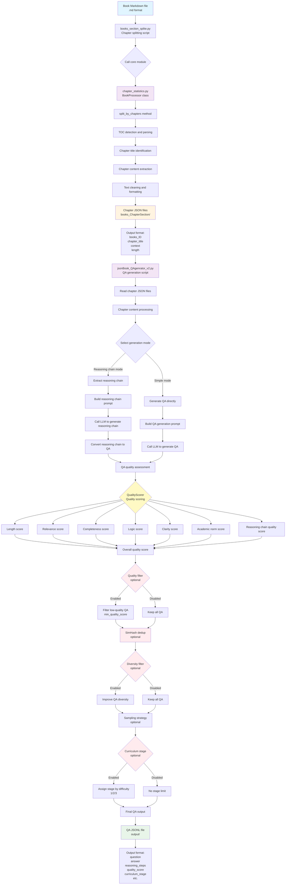

# Book Chapter Splitting and QA Generation Tool Guide

This toolkit processes book files by splitting them into chapters by table of contents, then generating question-answer (QA) pairs for model training.

## Tool Overview

This toolkit includes three main scripts:

1. **`chapter_statistics.py`** - Chapter statistics module providing core chapter splitting functionality
2. **`books_section_splite.py`** - Chapter splitting script that calls `chapter_statistics.py` for splitting
3. **`jsonBook_QAgenrator_v2.py`** - QA generation script that generates QA pairs from split chapters

## Core Innovations

### 1. TOC-Aware Chapter Splitting

Traditional methods split by character count or fixed length, leaving chapter content incomplete. This tool intelligently identifies chapter boundaries from Markdown structure (`#`, `##`, `###` heading markers):

```
Book Markdown
    ↓ Detect TOC markers
Identify chapter hierarchy
    ↓ Split by headings
Preserve complete chapter content
```

- **Hierarchy preservation**: Supports multi-level headings (chapter/section/subsection)
- **Title extraction**: Automatically identifies chapter titles and hierarchy
- **Context integrity**: Ensures each chapter content is continuous and complete

### 2. Book-Specific QA Templates

Dedicated QA generation templates designed for textbook-style books:

| Template Type | Use Case | Example |
|---------|---------|------|
| Factual QA | Concept definitions, data metrics | 水稻亩产量是多少？ |
| Principle QA | Mechanism explanation, causality | 光合作用如何影响作物产量？ |
| Method QA | Procedure steps, technical points | 如何进行水稻旱育秧？ |
| Comparative QA | Difference comparison, pros/cons | 籼稻与粳稻有何区别？ |

### 3. Hierarchical Quality Control

```
┌─────────────────────────────────────┐
│        Chapter-level QC             │
│  Length filter, format validation,  │
│  duplicate detection                │
├─────────────────────────────────────┤
│        Paragraph-level QC           │
│  Content density, topic relevance   │
├─────────────────────────────────────┤
│        QA-level QC                  │
│  Multi-dimensional scoring          │
│  (length/relevance/completeness...) │
└─────────────────────────────────────┘
```

- **Length scoring**: Evaluates whether QA length is appropriate
- **Relevance scoring**: Assesses QA relevance to source text
- **Completeness scoring**: Checks whether answers fully address questions
- **Logic scoring**: Validates logical coherence of QA pairs

### 4. SimHash Efficient Deduplication

For large-scale book content (hundreds of thousands of chapters), SimHash enables efficient similarity-based deduplication:

| Feature | Description |
|------|------|
| Algorithm | SimHash + Hamming distance |
| Threshold | Configurable (default 6; lower = stricter) |
| Efficiency | O(n) time complexity |
| Effect | Effectively removes near-duplicate QA with similar phrasing |

### 5. Automatic Curriculum Stage Assignment

Automatically assigns training stages by QA difficulty for progressive curriculum learning:

| Stage | Difficulty | Characteristics |
|------|------|------|
| Stage 1 | Basic | Single facts, simple QA |
| Stage 2 | Intermediate | Multi-knowledge links, explanatory QA |
| Stage 3 | Advanced | Complex reasoning, comprehensive analysis |

### 6. Multi-Dimensional Quality Filtering

```bash
# Enable full quality filtering pipeline
python jsonBook_QAgenrator_v2.py \
    --enable-quality-filter \
    --min-quality-score 75.0 \
    --enable-diversity-filter \
    --simhash-dedup-hamming 5
```

- **Quality threshold filtering**: Set minimum quality score threshold
- **Diversity filtering**: Avoid generating similar duplicate QA
- **Composable**: Each filtering step can be enabled/disabled independently

## Workflow

```
Book Markdown file
    ↓
[Step 1] books_section_splite.py (calls chapter_statistics.py)
    ↓
Split chapter JSON files (output to books_ChapterSection/)
    ↓
[Step 2] jsonBook_QAgenrator_v2.py
    ↓
QA pair JSON files (output to output/)
```

## Install Dependencies

```bash
# Install dependencies with uv (recommended)
uv sync

# Or use pip
pip install -r requirements.txt
```

## Usage Steps

### Step 1: Chapter Splitting

Use the `books_section_splite.py` script to split books by table-of-contents structure.

#### Basic Usage

```bash
# Method 1: Process a single file (via command-line argument)
python books_section_splite.py /path/to/book.md

# Method 2: Process multiple files
python books_section_splite.py /path/to/book1.md /path/to/book2.md

# Method 3: Use default input file (if configured in script)
python books_section_splite.py
```

#### Input Notes

- **Input format**: Markdown files (.md)
- **Input source**:
  - File paths specified via command-line arguments
  - Or default file paths configured in the script

#### Output Notes

- **Output directory**: `./books_ChapterSection/`
- **Output format**: JSON files (JSONL format, one JSON object per line)
- **Output content**: Each chapter includes the following fields:
  ```json
  {
    "books_ID": "Book ID (filename)",
    "chapter_title": "Chapter title",
    "context": "Chapter text content",
    "length": "Chapter length (character count)"
  }
  ```

#### How It Works

The `books_section_splite.py` script:
1. Reads input Markdown files
2. Calls the `BookProcessor` class in `chapter_statistics.py`
3. Uses the `split_by_chapters()` method to identify and split chapters
4. Saves each chapter as JSON

### Step 2: Generate QA Pairs

Use the `jsonBook_QAgenrator_v2.py` script to generate QA pairs from split chapters.

#### Quick Test with Sample Data

```bash
uv run python jsonBook_QAgenrator_v2.py --input examples/sample_books.jsonl --output output/
```

#### Basic Usage

```bash
# Use default input directory (books_ChapterSection/)
python jsonBook_QAgenrator_v2.py

# Specify input directory
python jsonBook_QAgenrator_v2.py --input /path/to/books_ChapterSection

# Specify input and output paths
python jsonBook_QAgenrator_v2.py --input /path/to/input --output /path/to/output.jsonl

# Specify target book IDs (process only selected books)
python jsonBook_QAgenrator_v2.py --target-ids 9787040599398 9787040470406
```

#### Main Parameters

| Parameter | Type | Default | Description |
|------|------|--------|------|
| `--input` | str | `books_ChapterSection/` | Input path: JSONL file or directory with multiple JSON/JSONL files |
| `--output` | str | Auto-generated | Output JSONL file path (auto-generated to `output/` if not specified) |
| `--model` | str | None | Model name |
| `--max-q-per-chunk` | int | None | Max QA pairs per chapter |
| `--target-ids` | list | [] | Target book ID list (process only specified books) |
| `--sample-strategy` | flag | False | Use sampling strategy |
| `--max-curriculum-stage` | int | None | Max curriculum stage (1/2/3; None = no limit) |
| `--enable-quality-filter` | flag | False | Enable quality filtering |
| `--min-quality-score` | float | 60.0 | Minimum quality score threshold |
| `--enable-diversity-filter` | flag | False | Enable diversity filtering |
| `--simhash-dedup-hamming` | int | 6 | SimHash dedup threshold (lower = stricter) |

#### Input Notes

- **Input format**: JSON or JSONL files
- **Input directory**: `books_ChapterSection/` (Step 1 output directory)
- **Input content**: JSON objects with `books_ID`, `chapter_title`, `context`, `length` fields

#### Output Notes

- **Output directory**: `output/`
- **Output format**: JSONL file (one QA pair per line)
- **Output content**: QA pairs with question, answer, reasoning chain, and related fields

#### Advanced Features

1. **Quality assessment**: Automatically scores generated QA
2. **Deduplication**: Uses SimHash to remove duplicate QA pairs
3. **Quality filtering**: Filter low-quality QA by minimum score threshold
4. **Diversity filtering**: Improve QA diversity
5. **Statistics report**: Automatically generates detailed statistics report

## Complete Examples

### Example 1: Process a Single Book File

```bash
# Step 1: Split chapters
python books_section_splite.py ./books_md/9787040599398.md

# Step 2: Generate QA (process all JSON files from previous step)
python jsonBook_QAgenrator_v2.py --input ./books_ChapterSection

# Or process only a specific book
python jsonBook_QAgenrator_v2.py --input ./books_ChapterSection --target-ids 9787040599398
```

### Example 2: Batch Process Multiple Book Files

```bash
# Step 1: Batch split chapters
python books_section_splite.py \
    /path/to/book1.md \
    /path/to/book2.md \
    /path/to/book3.md

# Step 2: Generate QA for all books
python jsonBook_QAgenrator_v2.py \
    --input ./books_ChapterSection \
    --enable-quality-filter \
    --min-quality-score 70.0 \
    --enable-diversity-filter
```

### Example 3: Quality and Diversity Filtering

```bash
# Step 1: Split chapters (same as above)
python books_section_splite.py /path/to/book.md

# Step 2: Generate QA with quality and diversity filtering enabled
python jsonBook_QAgenrator_v2.py \
    --input ./books_ChapterSection \
    --enable-quality-filter \
    --min-quality-score 75.0 \
    --enable-diversity-filter \
    --simhash-dedup-hamming 5 \
    --max-q-per-chunk 10
```

## Directory Structure

```
.
├── chapter_statistics.py          # Chapter statistics module (core splitting logic)
├── books_section_splite.py         # Chapter splitting script
├── jsonBook_QAgenrator_v2.py       # QA generation script
├── books_md/                       # Original book Markdown files
├── books_ChapterSection/           # Split chapter JSON files (Step 1 output)
└── output/                         # QA pair output directory (Step 2 output)
```

## Notes

1. **Environment dependencies**:
   - Python 3.x
   - Required packages (pandas, openpyxl, etc.)
   - `jsonBook_QAgenrator_v2.py` requires OpenAI API key (via `.env` file)

2. **File paths**:
   - Ensure input file paths are correct
   - Output directories are created automatically; no manual creation needed

3. **Processing order**:
   - **Step 1 (chapter splitting) must run first**, then Step 2 (QA generation)
   - Step 2 input must be Step 1 output

4. **Performance**:
   - Large files may take considerable time
   - Test with a small file set first

5. **Error handling**:
   - If a file fails, the script logs the error and continues with other files
   - Check log output for processing status

## Troubleshooting

1. **Input file not found**:
   - Verify file path is correct
   - Confirm file exists and is readable

2. **Chapter splitting failed**:
   - Check Markdown file format
   - Confirm file encoding is UTF-8

3. **QA generation failed**:
   - Check API key configuration
   - Confirm input JSON file format
   - Review logs for specific errors

## Contact and Support

For questions or suggestions, contact the project maintainer.

## Pipeline Flow Diagram

The complete processing pipeline from raw book files to final QA pairs:



### Flow Notes

1. **Input stage**: Raw book Markdown files (.md format)

2. **Chapter splitting stage**:
   - `books_section_splite.py` as entry script
   - Calls `BookProcessor` class in `chapter_statistics.py`
   - Performs TOC detection, chapter identification, content extraction
   - Outputs chapter files in JSON format

3. **QA generation stage**:
   - `jsonBook_QAgenrator_v2.py` reads chapter JSON files
   - Supports two modes: reasoning chain mode and simple mode
   - Calls LLM (OpenAI API) to generate QA pairs

4. **Quality processing stage** (optional):
   - **Quality assessment**: Multi-dimensional scoring via `QualityScorer`
   - **Quality filtering**: Filter low-quality QA by minimum score threshold
   - **Deduplication**: Remove duplicate QA via SimHash
   - **Diversity filtering**: Improve QA diversity
   - **Sampling strategy**: Optional sampling strategy
   - **Curriculum stage**: Assign training stages by difficulty (1/2/3)

5. **Output stage**: Final QA JSONL files with complete information
