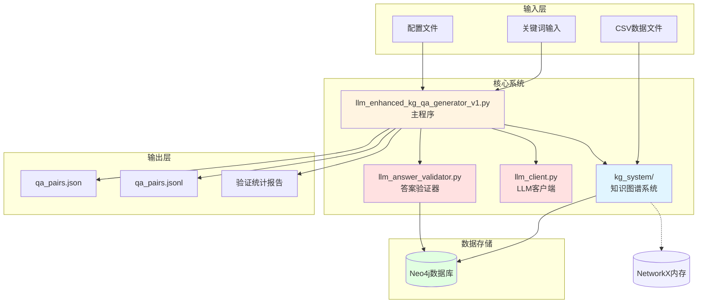
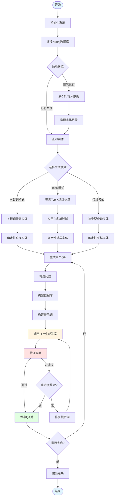
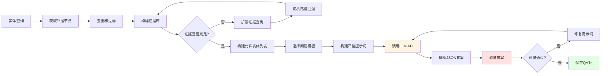
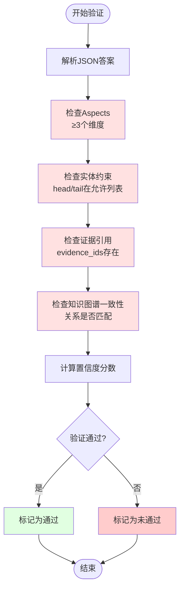
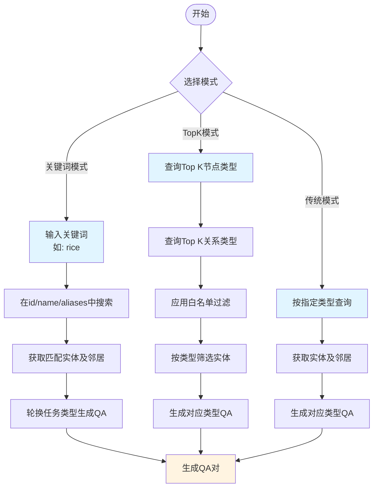
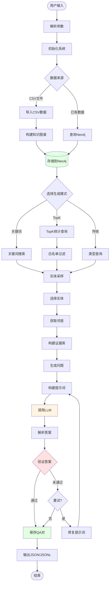
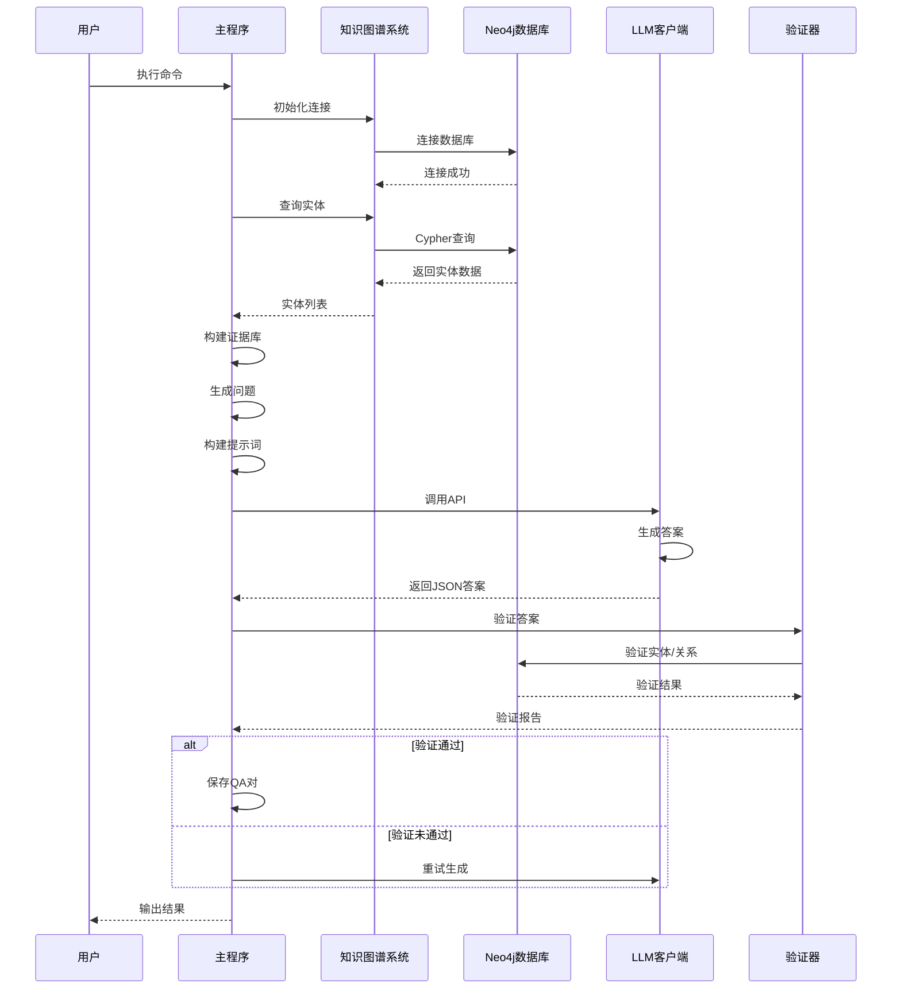

# 因果链QA生成器

> 基于Neo4j知识图谱 + 大语言模型的智能问答对生成系统

[](https://www.python.org/)
[](https://neo4j.com/)
[](LICENSE)

## 📋 目录

- [项目概述](#项目概述)
- [功能与创新点总结](#功能与创新点总结)
- [核心功能](#核心功能)
- [系统架构](#系统架构)
- [系统流程图](#系统流程图)
- [快速开始](#快速开始)
- [安装配置](#安装配置)
- [使用方法](#使用方法)
- [参数说明](#参数说明)
- [输出格式](#输出格式)
- [高级功能](#高级功能)
- [工作流程](#工作流程)
- [常见问题](#常见问题)

## 🎯 项目概述

本系统是一个**博士论文级**的智能问答对生成器，专门用于植物生物学领域的知识图谱问答。系统结合了：

- **Neo4j知识图谱**：存储和管理结构化的生物学知识
- **大语言模型（LLM）**：生成自然流畅的问题和答案
- **自动验证系统**：确保生成答案的科学准确性

### 主要特点

✅ **多维度QA生成**：支持基因功能、调控机制、表型分析、物种特征、调控通路等5种类型  
✅ **智能关键词搜索**：基于关键词（如"rice"）自动查找相关实体并生成QA  
✅ **TopK白名单过滤**：只使用统计报告中Top K的节点和关系类型，确保质量  
✅ **确定性模式**：支持可复现的生成结果，适用于测试和验证  
✅ **自动验证**：对生成的答案进行多维度验证，过滤低质量QA对  
✅ **灵活配置**：支持多种LLM API（OpenAI、Anthropic、本地模型）

## 💡 功能与创新点总结

### 🎯 核心功能

#### 1. 多类型QA生成系统
- **5种QA类型**：基因功能、调控机制、表型分析、物种特征、调控通路
- **自然问句生成**：使用自然语言模板，生成符合人类问答习惯的问题
- **结构化答案**：LLM输出严格JSON格式，包含aspects、claims、evidence等结构化信息

#### 2. 智能实体查询与采样
- **关键词搜索**：支持在实体的id、name、aliases、synonyms字段中多字段搜索
- **TopK统计模式**：直接从Neo4j查询Top K统计信息，无需预生成文件
- **确定性采样**：支持固定随机种子，确保结果可复现

#### 3. 证据库构建机制（P1-P3三层递进）
- **P1：邻居节点构建**：从中心实体的直接邻居构建初始证据库（快速高效）
- **P2：扩展查询**：当证据不足时，从Neo4j查询更多边进行扩展（合并out/in查询，减少数据库往返）
- **P3：随机路径回退**：如果仍然不足，使用随机路径查询作为回退机制（确保稀疏节点也能生成QA）
- **白名单过滤**：所有阶段都应用关系白名单过滤，确保质量
- **去重机制**：自动去重，避免重复的三元组
- **方向标记**：记录边的方向（out/in），支持有向图查询

#### 4. 多维度验证系统
- **Aspect验证**：确保答案至少包含3个维度（gene_function、regulation、pathway等），硬性要求（hard fail）
- **实体约束验证**：验证claims中的实体是否在允许列表中，支持实体别名映射
- **证据引用验证**：检查evidence_ids是否正确引用证据库中的证据，验证used_evidence完整性
- **知识图谱一致性验证**：验证答案中的关系是否与知识图谱一致，支持否定语义关系处理
- **信息因子计算**：计算info_factor（信息充足度因子），评估evidence覆盖、关系多样性、邻居重合度、非META占比
- **置信度评分**：计算答案的置信度分数，过滤低质量QA对
- **可疑token修复**：对GTP/ATP/ADP/ARF等前缀碎片、菌株号碎片等做白名单与上下文豁免
- **自动重试机制**：验证失败时自动修复提示词并重试（最多2次）

#### 5. 灵活配置与适配
- **多LLM API支持**：OpenAI、Anthropic、本地模型（OSS）、Mock模式（测试用）
- **环境变量配置**：通过.env文件灵活配置API端点、密钥、模型参数
- **动态API切换**：支持运行时切换不同的LLM API，无需重启程序
- **批量生成支持**：支持批量生成响应，提高处理效率
- **超时控制**：可配置API调用超时时间，避免长时间等待
- **错误回退**：API调用失败时自动回退到Mock模式，确保程序可运行

### 🚀 核心创新点

#### 1. **TopK白名单过滤机制** ⭐
- **创新性**：首次在QA生成中引入统计报告TopK白名单过滤
- **技术实现**：
  - 从Neo4j实时查询Top K节点类型和关系类型
  - 在实体筛选、证据扩展、随机路径查询等所有阶段应用白名单
  - 支持与低信息关系过滤叠加使用
- **优势**：确保只使用高质量、高频的节点和关系，提高QA对质量

#### 2. **P3随机路径回退机制** ⭐
- **创新性**：三层递进的证据库构建策略，确保即使中心实体邻居较少也能生成高质量QA
- **技术实现**：
  - P1：从邻居节点构建（快速，优先使用直接邻居）
  - P2：扩展查询（补充，合并out/in查询，减少数据库往返）
  - P3：随机路径回退（兜底，使用多跳随机路径查询）
  - 所有阶段都应用白名单过滤和去重机制
- **优势**：
  - 解决了知识图谱中稀疏节点难以生成QA的问题
  - 确保每个实体都能获得足够的证据支持
  - 通过白名单过滤保证证据质量

#### 3. **自然问句 + 隐式约束词表** ⭐
- **创新性**：使用自然语言问题模板，同时通过隐式约束词表确保答案质量
- **技术实现**：
  - 自然问句模板：生成符合人类问答习惯的问题
  - 隐式约束词表：禁止使用"图谱"、"三元组"等技术术语
  - 实体约束提示：确保答案中的实体来自允许列表
- **优势**：生成的QA对既自然流畅，又科学准确

#### 4. **严格JSON格式 + 多维度验证** ⭐
- **创新性**：LLM强制输出结构化JSON，结合多维度验证确保答案质量
- **技术实现**：
  - LLM输出格式：aspects(≥3) + claims + used_evidence + answer_text
  - 验证维度：aspect验证（硬性要求）、实体约束、证据引用、知识图谱一致性、信息因子
  - 重试机制：验证失败时自动修复提示词并重试（最多2次）
  - 可疑token修复：对GTP/ATP等生物学术语做白名单豁免
  - 否定语义处理：识别否定关系，计算effective_polarity
- **优势**：
  - 确保生成的答案结构化、可验证、高质量
  - 通过硬性要求（aspect_count < 3直接fail）保证最低质量标准
  - 信息因子评估答案的信息充足度，过滤低信息量答案

#### 5. **确定性模式** ⭐
- **创新性**：支持可复现的QA生成，适用于测试和基准测试
- **技术实现**：
  - 固定随机种子
  - 确定性采样和选择
  - 确保相同输入产生相同输出
- **优势**：便于测试、验证、对比不同版本的效果

#### 6. **关键词搜索 + 多任务类型轮换** ⭐
- **创新性**：基于关键词自动搜索实体，并轮换使用不同任务类型生成多样化QA
- **技术实现**：
  - 多字段搜索：id、name、aliases、synonyms
  - 任务类型轮换：基因功能、调控机制、表型分析、物种特征、调控通路
- **优势**：可以针对特定主题（如"rice"）生成全面的QA对集合

#### 7. **知识图谱一致性验证** ⭐
- **创新性**：不仅验证答案的结构，还验证答案与知识图谱的一致性
- **技术实现**：
  - 验证claims中的关系是否在知识图谱中存在
  - 验证实体之间的关系是否匹配（支持有向图查询）
  - 计算信息因子（info_factor）评估答案的信息量：
    - evidence覆盖度：使用的证据占证据库的比例
    - 关系多样性：claims中不同关系的数量
    - 邻居重合度：claims中的实体与中心实体邻居的重合度
    - 非META占比：非META claims占所有claims的比例
  - 支持否定语义关系处理
- **优势**：
  - 确保生成的答案与知识图谱数据一致，避免幻觉
  - 通过信息因子评估答案的信息充足度
  - 支持复杂的关系验证，包括否定关系

### 📊 技术亮点

1. **Neo4j/NetworkX 双后端支持**
   - 支持 Neo4j 和 NetworkX 两种后端，自动检测可用性并回退
   - NetworkX 后端适合开发测试，零配置
   - Neo4j 后端适合生产环境（百万级节点），支持复杂图查询
   - 合并out/in查询，减少数据库往返次数
   - 支持实时TopK统计查询，无需预生成文件

2. **LLM提示工程**
   - 精心设计的提示词模板，包含隐式约束词表
   - 自然问句模板，生成符合人类问答习惯的问题
   - 严格JSON格式要求，确保结构化输出
   - 自动修复提示词机制，提高验证通过率

3. **错误处理与重试**
   - 完善的错误处理和自动重试机制（最多2次）
   - API调用失败时自动回退到Mock模式
   - 验证失败时自动修复提示词并重试
   - 超时控制和异常捕获

4. **模块化设计**
   - 清晰的模块划分：查询层、生成层、验证层、输出层
   - 可复用的组件：实体目录、证据库构建、验证器等
   - 易于扩展和维护

5. **性能优化**
   - 合并查询：将out和in查询合并为UNION查询
   - 批量处理：支持批量生成响应
   - 去重机制：自动去重，避免重复计算
   - 确定性采样：使用高效的随机采样算法

6. **数据质量保证**
   - 多维度验证：aspect、实体、证据、知识图谱一致性
   - 白名单过滤：TopK节点和关系类型过滤
   - 低信息关系过滤：丢弃had/is/in等低信息关系
   - 信息因子评估：评估答案的信息充足度

### 🎓 应用价值

- **科研应用**：为植物生物学研究提供高质量的QA数据集
- **教育应用**：生成教学用的问答对，帮助学生理解复杂概念
- **知识服务**：构建智能问答系统，提供专业知识服务
- **数据质量**：通过多维度验证确保生成数据的科学性和准确性

## 🚀 核心功能

### 1. 多类型QA生成

系统支持生成5种不同类型的问答对：

- **基因功能**：解释基因的主要功能和作用机制
- **调控机制**：描述基因如何调控相关生理过程
- **表型分析**：分析表型的分子层面解释
- **物种特征**：概括物种的生物学特性
- **调控通路**：构建从触发到输出的机制链

### 2. 关键词搜索生成

基于关键词自动搜索相关实体并生成QA：

```bash
python llm_enhanced_kg_qa_generator_v1.py --keyword rice --keyword-qa-num 20
```

系统会在实体的`id`、`name`、`aliases`、`synonyms`字段中搜索关键词，自动匹配相关实体。

### 3. TopK统计信息模式

直接从Neo4j查询Top K统计信息，无需stats-json文件：

```bash
python llm_enhanced_kg_qa_generator_v1.py --use-top-stats --top-k 20
```

### 4. 确定性模式

启用确定性模式，确保结果可复现：

```bash
python llm_enhanced_kg_qa_generator_v1.py --deterministic-mode --seed 42
```

### 5. 自动验证系统

系统自动验证生成的答案，包括：

- **Aspect验证**：确保至少包含3个维度
- **实体约束**：验证claims中的实体是否在允许列表中
- **证据引用**：检查evidence_ids是否正确引用
- **知识图谱一致性**：验证答案与知识图谱的一致性

## 🏗️ 系统架构

```
博士论文级因果链QA生成器
│
├── 数据层
│   ├── CSV数据导入（NetworkX内存后端，无需Neo4j）
│   ├── Neo4j知识图谱数据库（可选，生产环境推荐）
│   ├── CSV数据导入（可选）
│   └── 实体目录（alias -> canonical映射）
│
├── 查询层
│   ├── 实体查询（按类型/关键词）
│   ├── 邻居查询（获取关联实体）
│   ├── 路径查询（多跳推理）
│   └── TopK统计查询
│
├── 生成层
│   ├── 问题生成（自然问句模板）
│   ├── 证据库构建（evidence bank）
│   ├── 提示词构建（严格JSON格式）
│   └── LLM调用（生成结构化答案）
│
├── 验证层
│   ├── Aspect验证（≥3个维度）
│   ├── 实体约束验证
│   ├── 证据引用验证
│   └── 知识图谱一致性验证
│
└── 输出层
    ├── JSON格式输出
    ├── JSONL格式输出
    └── 验证统计报告
```

## 📊 系统流程图

### 系统架构图



### 整体工作流程



### QA生成详细流程



### 验证流程



### 三种生成模式对比



### 数据流图



### 模块交互图



## ⚡ 快速开始

### 快速开始（使用示例数据）

```bash
uv run python llm_enhanced_kg_qa_generator_v1.py --csv examples/sample_kg.csv
```

### 1. 基本使用

生成10个基因功能QA对：

```bash
python llm_enhanced_kg_qa_generator_v1.py --gene-function 10
```

### 2. 关键词搜索

生成rice相关的20个QA对：

```bash
python llm_enhanced_kg_qa_generator_v1.py --keyword rice --keyword-qa-num 20
```

### 3. TopK模式

使用Top 20统计信息生成QA：

```bash
python llm_enhanced_kg_qa_generator_v1.py --use-top-stats --top-k 20 --gene-function 10
```

## 📦 安装配置

### 环境要求

- Python 3.8+
- Neo4j 4.0+（可选，用于生产环境；开发测试可用内置 NetworkX 后端）
- 依赖包（见requirements.txt）

### 安装步骤

1. **克隆项目**

```bash
git clone <repository-url>
cd agri_kg_neo4j_llm
```

2. **安装依赖**

### 安装

```bash
# 使用 uv 安装依赖（推荐）
uv sync

# 或使用 pip
pip install -r requirements.txt
```

3. **配置Neo4j（可选）**

系统会自动检测 Neo4j 是否可用：
- **如果 Neo4j 可用**：自动使用 Neo4j 后端
- **如果 Neo4j 不可用**：自动回退到 NetworkX 内存后端

如需配置 Neo4j 连接，在 `.env` 中设置：

```bash
NEO4J_URI=bolt://localhost:7687
NEO4J_USER=neo4j
NEO4J_PASSWORD=${NEO4J_PASSWORD}
```

4. **配置LLM API**

创建`.env`文件：

```bash
# OpenAI API配置
OPENAI_API_KEY=${OPENAI_API_KEY}
OPENAI_BASE_URL=${OPENAI_BASE_URL:-https://api.openai.com/v1}
OPENAI_MODEL=gpt-5.1
OPENAI_TEMPERATURE=0.7
OPENAI_MAX_TOKENS=8000

# LLM API类型选择
LLM_API_TYPE=openai  # 可选: openai, anthropic, local, mock
```

### 依赖包

主要依赖包括：

- `neo4j`：Neo4j数据库驱动
- `openai`：OpenAI API客户端
- `anthropic`：Anthropic Claude API客户端（可选）
- `python-dotenv`：环境变量管理

## 📖 使用方法

### 基本命令格式

```bash
python llm_enhanced_kg_qa_generator_v1.py [选项]
```

### 常用命令示例

#### 1. 传统模式（指定各类型数量）

```bash
python llm_enhanced_kg_qa_generator_v1.py \
    --gene-function 10 \
    --regulation 10 \
    --phenotype 10 \
    --species 10 \
    --pathway 10 \
    --output output/qa_pairs
```

#### 2. 关键词搜索模式

```bash
# 生成rice相关的QA
python llm_enhanced_kg_qa_generator_v1.py \
    --keyword rice \
    --keyword-qa-num 20 \
    --output output/rice_qa

# 生成wheat相关的QA
python llm_enhanced_kg_qa_generator_v1.py \
    --keyword wheat \
    --keyword-qa-num 15
```

#### 3. TopK统计信息模式

```bash
python llm_enhanced_kg_qa_generator_v1.py \
    --use-top-stats \
    --top-k 20 \
    --gene-function 10 \
    --regulation 10
```

#### 4. 确定性模式（可复现）

```bash
python llm_enhanced_kg_qa_generator_v1.py \
    --keyword rice \
    --keyword-qa-num 20 \
    --deterministic-mode \
    --seed 42
```

#### 5. 使用白名单过滤

```bash
python llm_enhanced_kg_qa_generator_v1.py \
    --stats-json output/import_stats.json \
    --restrict-to-report \
    --report-topk 20 \
    --gene-function 10
```

#### 6. 丢弃低信息关系

```bash
python llm_enhanced_kg_qa_generator_v1.py \
    --drop-generic-relations \
    --gene-function 10
```

## 🔧 参数说明

### 基本参数

| 参数 | 类型 | 默认值 | 说明 |
|------|------|--------|------|
| `--csv` | str | None | CSV知识图谱文件路径（可选，用于首次导入） |
| `--output` | str | `output` | 输出目录 |
| `--threshold` | float | `0.6` | 验证阈值 |

### QA类型参数

| 参数 | 类型 | 默认值 | 说明 |
|------|------|--------|------|
| `--gene-function` | int | `10` | 基因功能QA数量 |
| `--regulation` | int | `10` | 调控机制QA数量 |
| `--phenotype` | int | `10` | 表型分析QA数量 |
| `--species` | int | `10` | 物种特征QA数量 |
| `--pathway` | int | `10` | 调控通路QA数量 |

### 白名单参数

| 参数 | 类型 | 说明 |
|------|------|------|
| `--stats-json` | str | 统计报告JSON文件路径 |
| `--restrict-to-report` | flag | 启用统计报告白名单过滤 |
| `--report-topk` | int | 严格使用统计报告TopK（例如20） |
| `--drop-generic-relations` | flag | 丢弃低信息关系（had/is/in等） |
| `--restrict-species-to-top` | flag | 只允许top species |

### TopK统计参数

| 参数 | 类型 | 默认值 | 说明 |
|------|------|--------|------|
| `--use-top-stats` | flag | False | 从Neo4j直接查询Top K统计信息 |
| `--top-k` | int | `20` | Top K统计信息查询的K值 |

### 关键词搜索参数

| 参数 | 类型 | 默认值 | 说明 |
|------|------|--------|------|
| `--keyword` | str | None | 搜索关键词（如：rice, wheat） |
| `--keyword-qa-num` | int | `20` | 基于关键词生成的QA数量 |

### 确定性模式参数

| 参数 | 类型 | 默认值 | 说明 |
|------|------|--------|------|
| `--deterministic-mode` | flag | False | 启用确定性模式（可复现） |
| `--seed` | int | `42` | 随机种子（确定性模式下生效） |

### API选择参数

| 参数 | 类型 | 说明 |
|------|------|------|
| `--use-local` | flag | 使用本地OSS模型 |
| `--use-openai` | flag | 使用OpenAI API（默认，如果.env中LLM_API_TYPE=openai） |

## 📄 输出格式

### 输出文件

系统会在指定的输出目录生成两个文件：

1. **qa_pairs.jsonl**：JSONL格式，每行一个QA对
2. **qa_pairs.json**：JSON格式，包含所有QA对的数组

### QA对结构

每个QA对包含以下字段：

```json
{
  "type": "基因功能",
  "question": "你能用一段话讲清楚 Rice pollen 主要在做什么吗？...",
  "entity": "Rice pollen",
  "neighbors": [
    {"id": "UPS transcripts", "relations": ["accumulated large numbers of"]},
    ...
  ],
  "source": "Neo4j + Keyword(rice) + LLM(JSON:aspects+claim+evidence) + Validator",
  "answer": "{...JSON格式的答案...}",
  "allowed_entities": ["Rice pollen", "UPS transcripts", ...],
  "evidence_bank": {
    "E1": {"head": "...", "relation": "...", "tail": "...", "direction": "out"},
    ...
  },
  "validation": {
    "validation_passed": true/false,
    "aspect_validation": {...},
    "entity_validation": {...},
    "evidence_validation": {...},
    "claim_validation": {...},
    "confidence_score": 0.85,
    "validation_details": [...]
  }
}
```

### 答案JSON格式

LLM生成的答案采用严格的JSON格式：

```json
{
  "aspects": ["gene_function", "regulation", "pathway"],
  "answer_text": "200-320字左右，自然语言回答...",
  "claims": [
    {
      "head": "实体ID",
      "relation": "关系字符串",
      "tail": "实体ID",
      "polarity": "positive",
      "evidence_ids": ["E1", "E2"],
      "confidence": 0.85
    }
  ],
  "used_evidence": {
    "E1": {"head": "...", "relation": "...", "tail": "...", "direction": "out"}
  }
}
```

## 🎓 高级功能

### 1. 白名单过滤

使用统计报告白名单，只生成Top K的节点和关系类型：

```bash
python llm_enhanced_kg_qa_generator_v1.py \
    --stats-json output/import_stats.json \
    --restrict-to-report \
    --report-topk 20
```

### 2. 低信息关系过滤

丢弃低信息量的关系（如had, is, in等）：

```bash
python llm_enhanced_kg_qa_generator_v1.py \
    --drop-generic-relations \
    --gene-function 10
```

### 3. 组合使用

结合多种功能：

```bash
python llm_enhanced_kg_qa_generator_v1.py \
    --keyword rice \
    --keyword-qa-num 30 \
    --use-top-stats \
    --top-k 20 \
    --deterministic-mode \
    --seed 42 \
    --drop-generic-relations \
    --output output/rice_qa_top20
```

## 🔍 工作流程

系统工作流程分为7个主要阶段，流程图见上方"系统流程图"部分。以下是各阶段的详细说明：

### 1. 实体查询阶段

- 根据类型或关键词查询候选实体
- 获取实体的邻居节点和关系
- 应用白名单过滤（如果启用）

### 2. 证据库构建阶段

- 从邻居节点构建初始证据库
- 扩展证据（从Neo4j查询更多边）
- 随机路径回退（如果证据不足）

**P3 注入边代码实现**：

```python
def build_evidence_bank(
    self,
    center_entity: str,
    neighbors: List[Dict],
    max_edges: int = 30,
    min_edges_preferred: int = 6,
) -> Dict[str, Dict]:
    """构建证据库，包含P3随机路径回退机制"""
    center_entity = self._norm(center_entity)
    neighbors = self.dedup_neighbors(neighbors or [])

    triples: List[Dict[str, str]] = []
    seen = set()

    def add_triple(h: str, r: str, t: str, d: str = "out"):
        """添加三元组，自动去重和过滤"""
        h = self._norm(h)
        r = self._norm(r)
        t = self._norm(t)
        d = self._norm(d) or "out"
        if not (h and r and t):
            return
        if not self._relation_allowed(r):
            return
        key = (h, r, t, d)
        if key in seen:
            return
        seen.add(key)
        triples.append({"head": h, "relation": r, "tail": t, "direction": d})

    # 1) 从邻居节点构建初始证据库
    for n in neighbors[:max_edges]:
        rels = n.get("relations") or []
        rel = rels[0] if rels else ""
        nid = n.get("id")
        if nid and rel:
            add_triple(center_entity, rel, nid, "out")

    # 2) 如果证据不足，扩展查询更多边（NetworkX 和 Neo4j 都支持）
    if len(triples) < min_edges_preferred:
        extra = self._fetch_edges_from_neo4j(center_entity, limit_each=max_edges)
        for tr in extra:
            add_triple(tr["head"], tr["relation"], tr["tail"], tr.get("direction", "out"))
            if len(triples) >= max_edges:
                break

    # 3) P3: 如果仍然不足，使用随机路径回退（NetworkX 和 Neo4j 都支持）
    if len(triples) < min_edges_preferred:
        path = self._query_random_path(max_hops=2)
        if path:
            for tr in path.get("edges", []):
                add_triple(
                    tr.get("head", ""), 
                    tr.get("relation", ""), 
                    tr.get("tail", ""), 
                    tr.get("direction", "out")
                )
                if len(triples) >= max_edges:
                    break

    # 构建证据库字典
    evidence_bank: Dict[str, Dict] = {}
    for i, tr in enumerate(triples[:max_edges], start=1):
        evidence_bank[f"E{i}"] = tr
    return evidence_bank
```

**P3机制说明**：
- **触发条件**：当从邻居节点和扩展查询获得的证据仍然不足时（`len(triples) < min_edges_preferred`）
- **实现方式**：调用`_query_random_path(max_hops=2)`查询随机路径
- **作用**：确保即使中心实体的直接邻居较少，也能通过随机路径获取足够的证据来生成QA对
- **白名单过滤**：随机路径中的关系也会经过`_relation_allowed()`过滤，确保只使用高质量关系

### 3. 问题生成阶段

- 根据任务类型选择问题模板
- 使用确定性选择（如果启用确定性模式）
- 格式化问题（替换实体名称）

### 4. 提示词构建阶段

- 构建严格的JSON格式提示词
- 包含隐式约束词表
- 指定aspects要求
- 提供allowed_entities列表

### 5. LLM生成阶段

- 调用LLM API生成答案
- 重试机制（最多2次）
- 错误处理和回退

### 6. 验证阶段

- Aspect验证（≥3个维度）
- 实体约束验证
- 证据引用验证
- 知识图谱一致性验证

### 7. 输出阶段

- 保存为JSON和JSONL格式
- 生成验证统计报告

## ❓ 常见问题

### Q1: 如何配置LLM API？

A: 在`.env`文件中配置：

```bash
LLM_API_TYPE=openai
OPENAI_API_KEY=${OPENAI_API_KEY}
OPENAI_BASE_URL=http://your-endpoint/v1
```

### Q2: 确定性模式有什么用？

A: 确定性模式确保每次运行生成相同的QA对，适用于：
- 测试和验证
- 基准测试
- 结果复现

### Q3: 如何只生成特定类型的QA？

A: 只指定需要的类型参数：

```bash
python llm_enhanced_kg_qa_generator_v1.py --gene-function 20
```

### Q4: 验证失败怎么办？

A: 系统会自动重试（最多2次）。如果仍然失败，会保留QA对但标记为未通过验证。可以：
- 检查验证详情
- 调整验证阈值
- 检查知识图谱数据质量

### Q5: 如何提高QA质量？

A: 建议：
- 使用`--restrict-to-report`和`--report-topk`限制到Top K
- 使用`--drop-generic-relations`过滤低信息关系
- 提高验证阈值
- 确保知识图谱数据质量

## 📊 性能指标

- **查询速度**：Top 20统计信息查询 < 5秒
- **QA生成速度**：每个QA对约10-30秒（取决于LLM API响应时间）
- **验证速度**：每个QA对验证 < 1秒
- **内存占用**：约500MB-1GB（取决于知识图谱大小）

## 🤝 贡献

欢迎提交Issue和Pull Request！

## 📝 许可证

MIT License

## 📧 联系方式

如有问题或建议，请提交Issue。

---

**注意**：本系统支持两种后端：
- **NetworkX（推荐用于开发测试）**：零配置，无需安装额外服务，直接从CSV加载
- **Neo4j（推荐用于生产环境）**：适合大规模知识图谱（百万级以上），需要 Neo4j 服务

请确保在运行前正确配置 `.env` 文件中的 LLM API。


