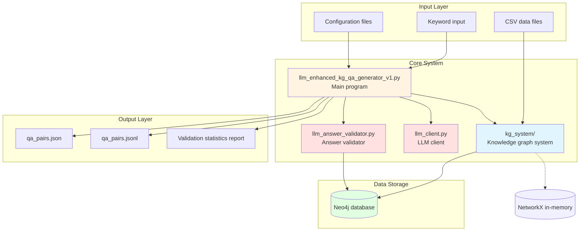
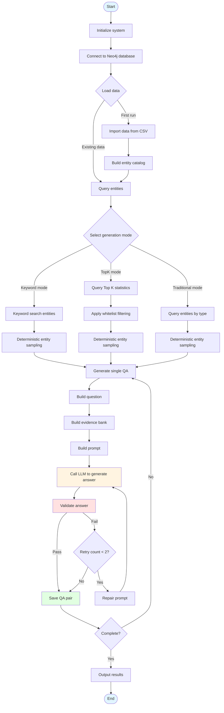
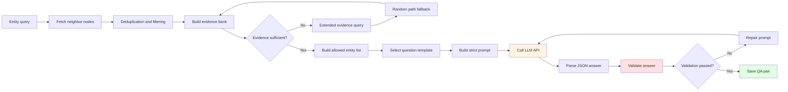
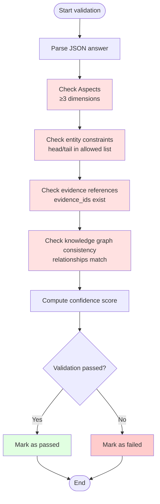
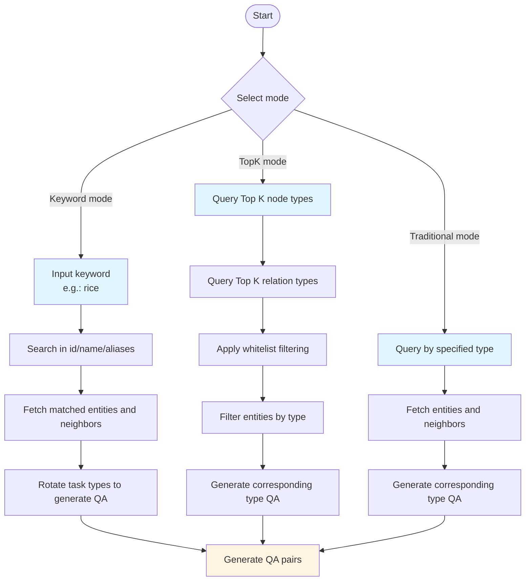
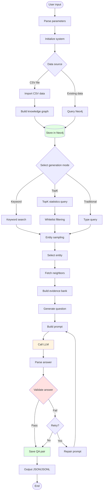
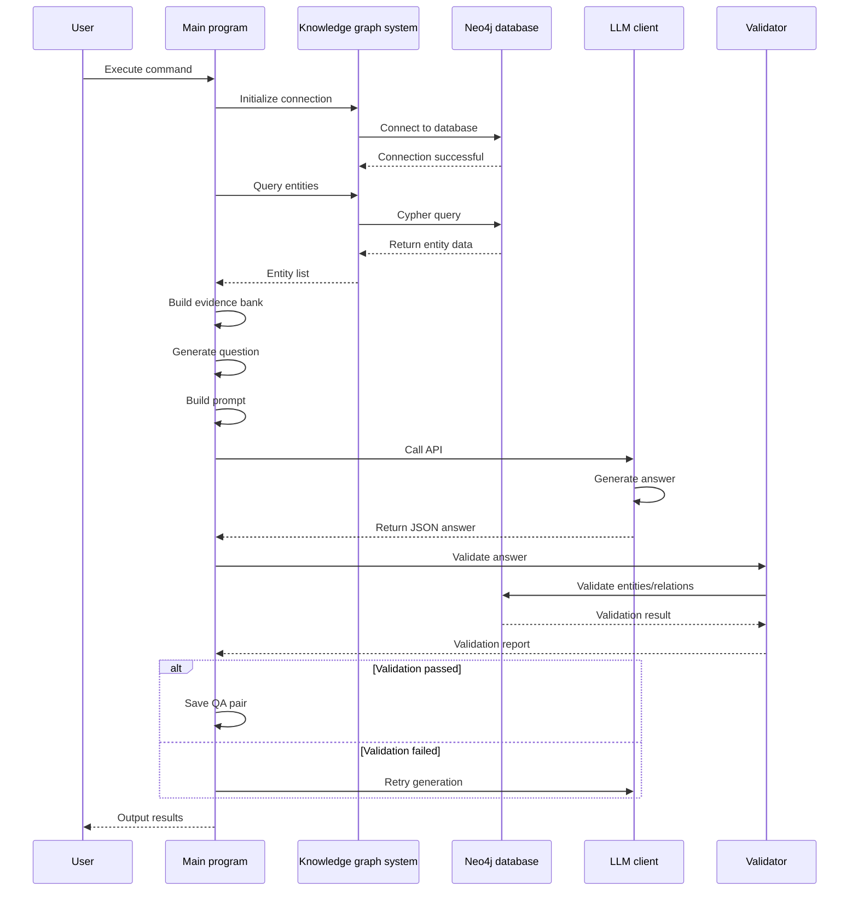

# Causal Chain QA Generator

> Intelligent question-answer pair generation system based on Neo4j knowledge graphs + large language models

[](https://www.python.org/)
[](https://neo4j.com/)
[](LICENSE)

## 📋 Table of Contents

- [Project Overview](#project-overview)
- [Features and Innovations Summary](#features-and-innovations-summary)
- [Core Features](#core-features)
- [System Architecture](#system-architecture)
- [System Flow Diagrams](#system-flow-diagrams)
- [Quick Start](#quick-start)
- [Installation and Configuration](#installation-and-configuration)
- [Usage](#usage)
- [Parameter Reference](#parameter-reference)
- [Output Format](#output-format)
- [Advanced Features](#advanced-features)
- [Workflow](#workflow)
- [FAQ](#faq)

## 🎯 Project Overview

This system is a **PhD-thesis-grade** intelligent question-answer pair generator designed for knowledge graph QA in plant biology. The system combines:

- **Neo4j knowledge graph**: Stores and manages structured biological knowledge
- **Large language model (LLM)**: Generates natural, fluent questions and answers
- **Automatic validation system**: Ensures scientific accuracy of generated answers

### Key Characteristics

✅ **Multi-dimensional QA generation**: Supports 5 types — gene function, regulatory mechanism, phenotype analysis, species characteristics, and regulatory pathway  
✅ **Intelligent keyword search**: Automatically finds related entities and generates QA based on keywords (e.g., "rice")  
✅ **TopK whitelist filtering**: Uses only Top K node and relation types from statistical reports to ensure quality  
✅ **Deterministic mode**: Supports reproducible generation results for testing and validation  
✅ **Automatic validation**: Multi-dimensional validation of generated answers to filter low-quality QA pairs  
✅ **Flexible configuration**: Supports multiple LLM APIs (OpenAI, Anthropic, local models)

## 💡 Features and Innovations Summary

### 🎯 Core Features

#### 1. Multi-type QA generation system
- **5 QA types**: Gene function, regulatory mechanism, phenotype analysis, species characteristics, regulatory pathway
- **Natural question generation**: Uses natural language templates to produce human-like questions
- **Structured answers**: LLM outputs strict JSON format with structured fields including aspects, claims, evidence, etc.

#### 2. Intelligent entity query and sampling
- **Keyword search**: Multi-field search across entity id, name, aliases, and synonyms
- **TopK statistics mode**: Queries Top K statistics directly from Neo4j without pre-generated files
- **Deterministic sampling**: Supports fixed random seeds for reproducible results

#### 3. Evidence bank construction (P1–P3 progressive layers)
- **P1: Neighbor node construction**: Builds initial evidence bank from direct neighbors of the center entity (fast and efficient)
- **P2: Extended query**: When evidence is insufficient, queries more edges from Neo4j (merges out/in queries to reduce database round trips)
- **P3: Random path fallback**: If still insufficient, uses random path queries as a fallback (ensures sparse nodes can still generate QA)
- **Whitelist filtering**: Relation whitelist applied at all stages to ensure quality
- **Deduplication**: Automatic deduplication to avoid duplicate triples
- **Direction marking**: Records edge direction (out/in) for directed graph queries

#### 4. Multi-dimensional validation system
- **Aspect validation**: Ensures answers contain at least 3 dimensions (gene_function, regulation, pathway, etc.) — hard fail requirement
- **Entity constraint validation**: Validates that entities in claims are in the allowed list; supports entity alias mapping
- **Evidence reference validation**: Checks that evidence_ids correctly reference evidence in the evidence bank; validates used_evidence completeness
- **Knowledge graph consistency validation**: Validates that relationships in answers are consistent with the knowledge graph; supports negation semantics
- **Info factor calculation**: Computes info_factor (information sufficiency factor) assessing evidence coverage, relation diversity, neighbor overlap, and non-META ratio
- **Confidence scoring**: Computes answer confidence scores to filter low-quality QA pairs
- **Suspicious token repair**: Whitelist and context exemptions for prefix fragments like GTP/ATP/ADP/ARF and strain number fragments
- **Automatic retry**: Automatically repairs prompts and retries on validation failure (up to 2 attempts)

#### 5. Flexible configuration and adaptation
- **Multi-LLM API support**: OpenAI, Anthropic, local models (OSS), Mock mode (for testing)
- **Environment variable configuration**: Flexible API endpoint, key, and model parameter configuration via .env file
- **Dynamic API switching**: Switch between LLM APIs at runtime without restarting
- **Batch generation support**: Supports batch response generation for improved throughput
- **Timeout control**: Configurable API call timeout to avoid long waits
- **Error fallback**: Automatically falls back to Mock mode on API failure to keep the program runnable

### 🚀 Core Innovations

#### 1. **TopK whitelist filtering mechanism** ⭐
- **Innovation**: First introduction of statistical report TopK whitelist filtering in QA generation
- **Implementation**:
  - Queries Top K node types and relation types from Neo4j in real time
  - Applies whitelist at all stages: entity filtering, evidence expansion, random path queries
  - Can be combined with low-information relation filtering
- **Advantage**: Ensures only high-quality, high-frequency nodes and relations are used, improving QA pair quality

#### 2. **P3 random path fallback mechanism** ⭐
- **Innovation**: Three-layer progressive evidence bank construction strategy ensuring high-quality QA even when center entities have few neighbors
- **Implementation**:
  - P1: Build from neighbor nodes (fast, prioritizes direct neighbors)
  - P2: Extended query (supplement, merges out/in queries to reduce database round trips)
  - P3: Random path fallback (safety net, uses multi-hop random path queries)
  - Whitelist filtering and deduplication applied at all stages
- **Advantage**:
  - Solves the problem of sparse nodes in knowledge graphs being difficult to generate QA for
  - Ensures every entity gets sufficient evidence support
  - Maintains evidence quality through whitelist filtering

#### 3. **Natural questions + implicit constraint vocabulary** ⭐
- **Innovation**: Uses natural language question templates with implicit constraint vocabulary to ensure answer quality
- **Implementation**:
  - Natural question templates: Generate human-like questions
  - Implicit constraint vocabulary: Prohibits technical terms like "graph", "triple", etc.
  - Entity constraint prompts: Ensures answer entities come from the allowed list
- **Advantage**: Generated QA pairs are both natural and scientifically accurate

#### 4. **Strict JSON format + multi-dimensional validation** ⭐
- **Innovation**: Forces LLM to output structured JSON combined with multi-dimensional validation to ensure answer quality
- **Implementation**:
  - LLM output format: aspects(≥3) + claims + used_evidence + answer_text
  - Validation dimensions: aspect validation (hard requirement), entity constraints, evidence references, knowledge graph consistency, info factor
  - Retry mechanism: Automatically repairs prompts and retries on validation failure (up to 2 attempts)
  - Suspicious token repair: Whitelist exemptions for biological terms like GTP/ATP
  - Negation semantics: Recognizes negation relations, computes effective_polarity
- **Advantage**:
  - Ensures generated answers are structured, verifiable, and high quality
  - Hard requirement (aspect_count < 3 fails directly) guarantees minimum quality standard
  - Info factor assesses answer information sufficiency, filtering low-information answers

#### 5. **Deterministic mode** ⭐
- **Innovation**: Supports reproducible QA generation for testing and benchmarking
- **Implementation**:
  - Fixed random seed
  - Deterministic sampling and selection
  - Ensures same input produces same output
- **Advantage**: Facilitates testing, validation, and comparison across versions

#### 6. **Keyword search + multi-task type rotation** ⭐
- **Innovation**: Automatically searches entities by keyword and rotates task types to generate diverse QA
- **Implementation**:
  - Multi-field search: id, name, aliases, synonyms
  - Task type rotation: Gene function, regulatory mechanism, phenotype analysis, species characteristics, regulatory pathway
- **Advantage**: Can generate comprehensive QA pair collections for specific topics (e.g., "rice")

#### 7. **Knowledge graph consistency validation** ⭐
- **Innovation**: Validates not only answer structure but also consistency with the knowledge graph
- **Implementation**:
  - Validates that relationships in claims exist in the knowledge graph
  - Validates that entity relationships match (supports directed graph queries)
  - Computes info_factor to assess answer information content:
    - Evidence coverage: Ratio of used evidence to evidence bank
    - Relation diversity: Number of distinct relations in claims
    - Neighbor overlap: Overlap between claim entities and center entity neighbors
    - Non-META ratio: Ratio of non-META claims to all claims
  - Supports negation semantics handling
- **Advantage**:
  - Ensures generated answers are consistent with knowledge graph data, avoiding hallucinations
  - Assesses answer information sufficiency via info factor
  - Supports complex relationship validation including negation

### 📊 Technical Highlights

1. **Neo4j/NetworkX dual backend support**
   - Supports Neo4j and NetworkX backends with automatic availability detection and fallback
   - NetworkX backend suitable for development and testing, zero configuration
   - Neo4j backend suitable for production (millions of nodes), supports complex graph queries
   - Merges out/in queries to reduce database round trips
   - Supports real-time TopK statistics queries without pre-generated files

2. **LLM prompt engineering**
   - Carefully designed prompt templates with implicit constraint vocabulary
   - Natural question templates for human-like questions
   - Strict JSON format requirements for structured output
   - Automatic prompt repair mechanism to improve validation pass rate

3. **Error handling and retry**
   - Comprehensive error handling and automatic retry (up to 2 attempts)
   - Automatic fallback to Mock mode on API failure
   - Automatic prompt repair and retry on validation failure
   - Timeout control and exception handling

4. **Modular design**
   - Clear module separation: query layer, generation layer, validation layer, output layer
   - Reusable components: entity catalog, evidence bank construction, validators
   - Easy to extend and maintain

5. **Performance optimization**
   - Merged queries: Combines out and in queries into UNION queries
   - Batch processing: Supports batch response generation
   - Deduplication: Automatic deduplication to avoid redundant computation
   - Deterministic sampling: Efficient random sampling algorithms

6. **Data quality assurance**
   - Multi-dimensional validation: aspect, entity, evidence, knowledge graph consistency
   - Whitelist filtering: TopK node and relation type filtering
   - Low-information relation filtering: Discards low-information relations like had/is/in
   - Info factor assessment: Evaluates answer information sufficiency

### 🎓 Application Value

- **Research applications**: Provides high-quality QA datasets for plant biology research
- **Educational applications**: Generates teaching QA pairs to help students understand complex concepts
- **Knowledge services**: Builds intelligent QA systems for domain knowledge services
- **Data quality**: Ensures scientific accuracy of generated data through multi-dimensional validation

## 🚀 Core Features

### 1. Multi-type QA generation

The system supports generating 5 different types of question-answer pairs:

- **Gene function**: Explains the main functions and mechanisms of genes
- **Regulatory mechanism**: Describes how genes regulate related physiological processes
- **Phenotype analysis**: Analyzes molecular-level explanations of phenotypes
- **Species characteristics**: Summarizes biological characteristics of species
- **Regulatory pathway**: Constructs mechanism chains from trigger to output

### 2. Keyword search generation

Automatically searches related entities and generates QA based on keywords:

```bash
python llm_enhanced_kg_qa_generator_v1.py --keyword rice --keyword-qa-num 20
```

The system searches keywords in entity `id`, `name`, `aliases`, and `synonyms` fields to automatically match related entities.

### 3. TopK statistics mode

Queries Top K statistics directly from Neo4j without a stats-json file:

```bash
python llm_enhanced_kg_qa_generator_v1.py --use-top-stats --top-k 20
```

### 4. Deterministic mode

Enable deterministic mode for reproducible results:

```bash
python llm_enhanced_kg_qa_generator_v1.py --deterministic-mode --seed 42
```

### 5. Automatic validation system

The system automatically validates generated answers, including:

- **Aspect validation**: Ensures at least 3 dimensions are included
- **Entity constraints**: Validates that entities in claims are in the allowed list
- **Evidence references**: Checks that evidence_ids are correctly referenced
- **Knowledge graph consistency**: Validates answer consistency with the knowledge graph

## 🏗️ System Architecture

```
PhD-thesis-grade Causal Chain QA Generator
│
├── Data Layer
│   ├── CSV data import (NetworkX in-memory backend, no Neo4j required)
│   ├── Neo4j knowledge graph database (optional, recommended for production)
│   ├── CSV data import (optional)
│   └── Entity catalog (alias -> canonical mapping)
│
├── Query Layer
│   ├── Entity query (by type/keyword)
│   ├── Neighbor query (fetch related entities)
│   ├── Path query (multi-hop reasoning)
│   └── TopK statistics query
│
├── Generation Layer
│   ├── Question generation (natural question templates)
│   ├── Evidence bank construction (evidence bank)
│   ├── Prompt construction (strict JSON format)
│   └── LLM invocation (generate structured answers)
│
├── Validation Layer
│   ├── Aspect validation (≥3 dimensions)
│   ├── Entity constraint validation
│   ├── Evidence reference validation
│   └── Knowledge graph consistency validation
│
└── Output Layer
    ├── JSON format output
    ├── JSONL format output
    └── Validation statistics report
```

## 📊 System Flow Diagrams

### System Architecture Diagram



### Overall Workflow



### QA Generation Detailed Flow



### Validation Flow



### Three Generation Mode Comparison



### Data Flow Diagram



### Module Interaction Diagram



## ⚡ Quick Start

### Quick Start (with sample data)

```bash
uv run python llm_enhanced_kg_qa_generator_v1.py --csv examples/sample_kg.csv
```

### 1. Basic usage

Generate 10 gene function QA pairs:

```bash
python llm_enhanced_kg_qa_generator_v1.py --gene-function 10
```

### 2. Keyword search

Generate 20 rice-related QA pairs:

```bash
python llm_enhanced_kg_qa_generator_v1.py --keyword rice --keyword-qa-num 20
```

### 3. TopK mode

Generate QA using Top 20 statistics:

```bash
python llm_enhanced_kg_qa_generator_v1.py --use-top-stats --top-k 20 --gene-function 10
```

## 📦 Installation and Configuration

### Requirements

- Python 3.8+
- Neo4j 4.0+ (optional, for production; built-in NetworkX backend available for development and testing)
- Dependencies (see requirements.txt)

### Installation Steps

1. **Clone the project**

```bash
git clone <repository-url>
cd agri_kg_neo4j_llm
```

2. **Install dependencies**

### Installation

```bash
# Install dependencies with uv (recommended)
uv sync

# Or use pip
pip install -r requirements.txt
```

3. **Configure Neo4j (optional)**

The system automatically detects Neo4j availability:
- **If Neo4j is available**: Automatically uses Neo4j backend
- **If Neo4j is unavailable**: Automatically falls back to NetworkX in-memory backend

To configure Neo4j connection, set in `.env`:

```bash
NEO4J_URI=bolt://localhost:7687
NEO4J_USER=neo4j
NEO4J_PASSWORD=${NEO4J_PASSWORD}
```

4. **Configure LLM API**

Create a `.env` file:

```bash
# OpenAI API configuration
OPENAI_API_KEY=${OPENAI_API_KEY}
OPENAI_BASE_URL=${OPENAI_BASE_URL:-https://api.openai.com/v1}
OPENAI_MODEL=gpt-5.1
OPENAI_TEMPERATURE=0.7
OPENAI_MAX_TOKENS=8000

# LLM API type selection
LLM_API_TYPE=openai  # Options: openai, anthropic, local, mock
```

### Dependencies

Main dependencies include:

- `neo4j`: Neo4j database driver
- `openai`: OpenAI API client
- `anthropic`: Anthropic Claude API client (optional)
- `python-dotenv`: Environment variable management

## 📖 Usage

### Basic command format

```bash
python llm_enhanced_kg_qa_generator_v1.py [options]
```

### Common command examples

#### 1. Traditional mode (specify count per type)

```bash
python llm_enhanced_kg_qa_generator_v1.py \
    --gene-function 10 \
    --regulation 10 \
    --phenotype 10 \
    --species 10 \
    --pathway 10 \
    --output output/qa_pairs
```

#### 2. Keyword search mode

```bash
# Generate rice-related QA
python llm_enhanced_kg_qa_generator_v1.py \
    --keyword rice \
    --keyword-qa-num 20 \
    --output output/rice_qa

# Generate wheat-related QA
python llm_enhanced_kg_qa_generator_v1.py \
    --keyword wheat \
    --keyword-qa-num 15
```

#### 3. TopK statistics mode

```bash
python llm_enhanced_kg_qa_generator_v1.py \
    --use-top-stats \
    --top-k 20 \
    --gene-function 10 \
    --regulation 10
```

#### 4. Deterministic mode (reproducible)

```bash
python llm_enhanced_kg_qa_generator_v1.py \
    --keyword rice \
    --keyword-qa-num 20 \
    --deterministic-mode \
    --seed 42
```

#### 5. Use whitelist filtering

```bash
python llm_enhanced_kg_qa_generator_v1.py \
    --stats-json output/import_stats.json \
    --restrict-to-report \
    --report-topk 20 \
    --gene-function 10
```

#### 6. Drop low-information relations

```bash
python llm_enhanced_kg_qa_generator_v1.py \
    --drop-generic-relations \
    --gene-function 10
```

## 🔧 Parameter Reference

### Basic parameters

| Parameter | Type | Default | Description |
|------|------|--------|------|
| `--csv` | str | None | CSV knowledge graph file path (optional, for first-time import) |
| `--output` | str | `output` | Output directory |
| `--threshold` | float | `0.6` | Validation threshold |

### QA type parameters

| Parameter | Type | Default | Description |
|------|------|--------|------|
| `--gene-function` | int | `10` | Number of gene function QA pairs |
| `--regulation` | int | `10` | Number of regulatory mechanism QA pairs |
| `--phenotype` | int | `10` | Number of phenotype analysis QA pairs |
| `--species` | int | `10` | Number of species characteristic QA pairs |
| `--pathway` | int | `10` | Number of regulatory pathway QA pairs |

### Whitelist parameters

| Parameter | Type | Description |
|------|------|------|
| `--stats-json` | str | Statistical report JSON file path |
| `--restrict-to-report` | flag | Enable statistical report whitelist filtering |
| `--report-topk` | int | Strictly use statistical report TopK (e.g., 20) |
| `--drop-generic-relations` | flag | Drop low-information relations (had/is/in, etc.) |
| `--restrict-species-to-top` | flag | Allow only top species |

### TopK statistics parameters

| Parameter | Type | Default | Description |
|------|------|--------|------|
| `--use-top-stats` | flag | False | Query Top K statistics directly from Neo4j |
| `--top-k` | int | `20` | K value for Top K statistics query |

### Keyword search parameters

| Parameter | Type | Default | Description |
|------|------|--------|------|
| `--keyword` | str | None | Search keyword (e.g., rice, wheat) |
| `--keyword-qa-num` | int | `20` | Number of QA pairs to generate based on keyword |

### Deterministic mode parameters

| Parameter | Type | Default | Description |
|------|------|--------|------|
| `--deterministic-mode` | flag | False | Enable deterministic mode (reproducible) |
| `--seed` | int | `42` | Random seed (effective in deterministic mode) |

### API selection parameters

| Parameter | Type | Description |
|------|------|------|
| `--use-local` | flag | Use local OSS model |
| `--use-openai` | flag | Use OpenAI API (default if LLM_API_TYPE=openai in .env) |

## 📄 Output Format

### Output files

The system generates two files in the specified output directory:

1. **qa_pairs.jsonl**: JSONL format, one QA pair per line
2. **qa_pairs.json**: JSON format, array containing all QA pairs

### QA pair structure

Each QA pair contains the following fields:

```json
{
  "type": "基因功能",
  "question": "Can you explain in a paragraph what Rice pollen mainly does?...",
  "entity": "Rice pollen",
  "neighbors": [
    {"id": "UPS transcripts", "relations": ["accumulated large numbers of"]},
    ...
  ],
  "source": "Neo4j + Keyword(rice) + LLM(JSON:aspects+claim+evidence) + Validator",
  "answer": "{...JSON format answer...}",
  "allowed_entities": ["Rice pollen", "UPS transcripts", ...],
  "evidence_bank": {
    "E1": {"head": "...", "relation": "...", "tail": "...", "direction": "out"},
    ...
  },
  "validation": {
    "validation_passed": true/false,
    "aspect_validation": {...},
    "entity_validation": {...},
    "evidence_validation": {...},
    "claim_validation": {...},
    "confidence_score": 0.85,
    "validation_details": [...]
  }
}
```

### Answer JSON format

LLM-generated answers use strict JSON format:

```json
{
  "aspects": ["gene_function", "regulation", "pathway"],
  "answer_text": "Approximately 200-320 characters, natural language answer...",
  "claims": [
    {
      "head": "Entity ID",
      "relation": "Relation string",
      "tail": "Entity ID",
      "polarity": "positive",
      "evidence_ids": ["E1", "E2"],
      "confidence": 0.85
    }
  ],
  "used_evidence": {
    "E1": {"head": "...", "relation": "...", "tail": "...", "direction": "out"}
  }
}
```

## 🎓 Advanced Features

### 1. Whitelist filtering

Use statistical report whitelist to generate only Top K node and relation types:

```bash
python llm_enhanced_kg_qa_generator_v1.py \
    --stats-json output/import_stats.json \
    --restrict-to-report \
    --report-topk 20
```

### 2. Low-information relation filtering

Drop low-information relations (e.g., had, is, in):

```bash
python llm_enhanced_kg_qa_generator_v1.py \
    --drop-generic-relations \
    --gene-function 10
```

### 3. Combined usage

Combine multiple features:

```bash
python llm_enhanced_kg_qa_generator_v1.py \
    --keyword rice \
    --keyword-qa-num 30 \
    --use-top-stats \
    --top-k 20 \
    --deterministic-mode \
    --seed 42 \
    --drop-generic-relations \
    --output output/rice_qa_top20
```

## 🔍 Workflow

The system workflow is divided into 7 main phases. See the "System Flow Diagrams" section above for flowcharts. Detailed descriptions of each phase follow:

### 1. Entity query phase

- Query candidate entities by type or keyword
- Fetch neighbor nodes and relations for entities
- Apply whitelist filtering (if enabled)

### 2. Evidence bank construction phase

- Build initial evidence bank from neighbor nodes
- Extend evidence (query more edges from Neo4j)
- Random path fallback (if evidence is insufficient)

**P3 edge injection code implementation**:

```python
def build_evidence_bank(
    self,
    center_entity: str,
    neighbors: List[Dict],
    max_edges: int = 30,
    min_edges_preferred: int = 6,
) -> Dict[str, Dict]:
    """Build evidence bank with P3 random path fallback mechanism"""
    center_entity = self._norm(center_entity)
    neighbors = self.dedup_neighbors(neighbors or [])

    triples: List[Dict[str, str]] = []
    seen = set()

    def add_triple(h: str, r: str, t: str, d: str = "out"):
        """Add triple with automatic deduplication and filtering"""
        h = self._norm(h)
        r = self._norm(r)
        t = self._norm(t)
        d = self._norm(d) or "out"
        if not (h and r and t):
            return
        if not self._relation_allowed(r):
            return
        key = (h, r, t, d)
        if key in seen:
            return
        seen.add(key)
        triples.append({"head": h, "relation": r, "tail": t, "direction": d})

    # 1) Build initial evidence bank from neighbor nodes
    for n in neighbors[:max_edges]:
        rels = n.get("relations") or []
        rel = rels[0] if rels else ""
        nid = n.get("id")
        if nid and rel:
            add_triple(center_entity, rel, nid, "out")

    # 2) If evidence is insufficient, extend query for more edges (NetworkX and Neo4j both supported)
    if len(triples) < min_edges_preferred:
        extra = self._fetch_edges_from_neo4j(center_entity, limit_each=max_edges)
        for tr in extra:
            add_triple(tr["head"], tr["relation"], tr["tail"], tr.get("direction", "out"))
            if len(triples) >= max_edges:
                break

    # 3) P3: If still insufficient, use random path fallback (NetworkX and Neo4j both supported)
    if len(triples) < min_edges_preferred:
        path = self._query_random_path(max_hops=2)
        if path:
            for tr in path.get("edges", []):
                add_triple(
                    tr.get("head", ""), 
                    tr.get("relation", ""), 
                    tr.get("tail", ""), 
                    tr.get("direction", "out")
                )
                if len(triples) >= max_edges:
                    break

    # Build evidence bank dictionary
    evidence_bank: Dict[str, Dict] = {}
    for i, tr in enumerate(triples[:max_edges], start=1):
        evidence_bank[f"E{i}"] = tr
    return evidence_bank
```

**P3 mechanism description**:
- **Trigger condition**: When evidence from neighbor nodes and extended queries is still insufficient (`len(triples) < min_edges_preferred`)
- **Implementation**: Calls `_query_random_path(max_hops=2)` to query random paths
- **Purpose**: Ensures sufficient evidence for QA generation even when center entities have few direct neighbors
- **Whitelist filtering**: Relations in random paths are also filtered through `_relation_allowed()` to ensure only high-quality relations are used

### 3. Question generation phase

- Select question template based on task type
- Use deterministic selection (if deterministic mode is enabled)
- Format question (replace entity names)

### 4. Prompt construction phase

- Build strict JSON format prompt
- Include implicit constraint vocabulary
- Specify aspects requirements
- Provide allowed_entities list

### 5. LLM generation phase

- Call LLM API to generate answer
- Retry mechanism (up to 2 attempts)
- Error handling and fallback

### 6. Validation phase

- Aspect validation (≥3 dimensions)
- Entity constraint validation
- Evidence reference validation
- Knowledge graph consistency validation

### 7. Output phase

- Save in JSON and JSONL formats
- Generate validation statistics report

## ❓ FAQ

### Q1: How do I configure the LLM API?

A: Configure in the `.env` file:

```bash
LLM_API_TYPE=openai
OPENAI_API_KEY=${OPENAI_API_KEY}
OPENAI_BASE_URL=http://your-endpoint/v1
```

### Q2: What is deterministic mode for?

A: Deterministic mode ensures the same QA pairs are generated on each run. Useful for:
- Testing and validation
- Benchmarking
- Result reproduction

### Q3: How do I generate only specific QA types?

A: Specify only the needed type parameters:

```bash
python llm_enhanced_kg_qa_generator_v1.py --gene-function 20
```

### Q4: What if validation fails?

A: The system automatically retries (up to 2 attempts). If still failing, the QA pair is retained but marked as validation failed. You can:
- Check validation details
- Adjust validation threshold
- Check knowledge graph data quality

### Q5: How do I improve QA quality?

A: Recommendations:
- Use `--restrict-to-report` and `--report-topk` to limit to Top K
- Use `--drop-generic-relations` to filter low-information relations
- Increase validation threshold
- Ensure knowledge graph data quality

## 📊 Performance Metrics

- **Query speed**: Top 20 statistics query < 5 seconds
- **QA generation speed**: ~10–30 seconds per QA pair (depends on LLM API response time)
- **Validation speed**: < 1 second per QA pair
- **Memory usage**: ~500MB–1GB (depends on knowledge graph size)

## 🤝 Contributing

Issues and Pull Requests are welcome!

## 📝 License

MIT License

## 📧 Contact

For questions or suggestions, please submit an Issue.

---

**Note**: This system supports two backends:
- **NetworkX (recommended for development and testing)**: Zero configuration, no additional services required, loads directly from CSV
- **Neo4j (recommended for production)**: Suitable for large-scale knowledge graphs (millions of nodes and above), requires Neo4j service

Please ensure the LLM API in the `.env` file is correctly configured before running.
