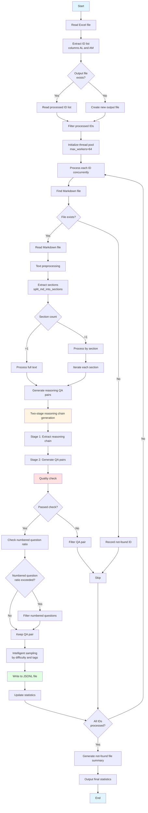

# PaperQAGenerator v9.3 - Intelligent Ratio Control Edition

## 📋 Project Overview

PaperQAGenerator is an intelligent system that automatically generates high-quality question-answer (QA) pairs from academic papers (Markdown format). Designed for agriculture and life sciences, it supports two-stage reasoning chain generation, automatically extracting knowledge from papers and producing QA pairs suitable for LLM SFT training.

### Core Features

- ✅ **Two-stage reasoning chain generation**: All sections use reasoning chain generation to ensure QA pairs include logical reasoning steps
- ✅ **Intelligent ratio control**: Automatically controls the proportion of numbered questions (default max 10%), balancing simplicity and complexity
- ✅ **High-quality filtering**: Multi-dimensional quality checks to filter out non-compliant QA pairs
- ✅ **Batch processing**: Supports reading ID lists from Excel files and concurrent processing of multiple papers
- ✅ **Real-time statistics**: Displays processing progress, LLM call count, generated QA count, and other live metrics
- ✅ **Checkpoint resume**: Supports continuing from existing output files, automatically skipping already-processed papers

## 🎯 Main Functional Modules

### 1. LLM Call Module
- Integrates Anthropic Responses API and OpenAI Chat Completions API
- Supports multiple models (gpt-5.1, gpt-oss-120b, etc.)
- Automatically extracts Chain of Thought (CoT) content
- Thread-safe call counter

### 2. Text Preprocessing Module
- Intelligently extracts sections from Markdown papers
- Automatically identifies and skips paper titles, references, and other irrelevant content
- Supports section merging and priority sorting
- Basic text cleaning (removes images, tables, formulas, etc.)

### 3. Two-Stage Reasoning Chain Generation Module
- **Stage 1**: Extract reasoning chains from section text (3–7 logical steps)
- **Stage 2**: Convert reasoning chains into QA pairs requiring multi-step reasoning
- All sections use reasoning chain generation to ensure QA pairs include reasoning steps

### 4. Numbered Question Ratio Control Module
- Intelligently controls the proportion of numbered questions (①②③, etc.; default max 10%)
- Strict quality checks for numbered questions:
  - Question length ≤ 250 characters
  - No more than 2 numbered points
  - Each numbered point content ≤ 20 characters
  - No redundant lead-in phrases

### 5. Intelligent Quality Filtering Module
- Forbidden phrase detection (e.g., "文中指出", "本文认为", etc.)
- Research dependency checks (avoids phrasing tied to a specific paper)
- Author information filtering
- Assumption/known-condition count checks
- Answer-repeats-question checks
- Unmentioned specific case checks

### 6. File Processing Module
- Reads ID lists from Excel files (supports columns AL and AM)
- Supports relative path lookup
- Automatically searches for Markdown files across multiple search paths
- Generates summary reports for files not found

### 7. Quality Control Module
- Difficulty grading (easy/medium/hard)
- Tag classification (concept, mechanism, method, result, etc.)
- Intelligent sampling strategy (by difficulty ratio and tag diversity)

## 📦 System Requirements

- Python 3.7+
- Dependencies:
  - `pandas` - Excel file processing
  - `openai` - LLM API calls
  - `python-dotenv` - Environment variable management

## ⚙️ Installation and Configuration

### 1. Install Dependencies

### Installation

```bash
# Install dependencies with uv (recommended)
uv sync

# Or use pip
pip install -r requirements.txt
```

### 2. Environment Configuration

Create a `.env` file in the same directory as the script and configure API keys:

```env
OPENAI_API_KEY=${OPENAI_API_KEY}
API_BASE_URL=https://api.openai.com/v1  # Optional; defaults to OpenAI standard endpoint
```

### 3. Configure Search Paths

Modify the `SEARCH_BASE_PATHS` variable in the script to set Markdown file search paths:

```python
SEARCH_BASE_PATHS = [
    "data/pubmed_nxml_md",
    "data/crawl4ai",
    "data/sci_hub_md",
]
```

## 🚀 Usage

### Quick Start (Using Sample Data)

```bash
uv run python PaperQAGenerator_v9.3.py --search-paths examples/
```

### Basic Usage

1. **Prepare Excel File**
   - Excel file must contain column AL (column 38) and column AM (column 39)
   - Columns AL and AM can contain file IDs or relative paths
   - Column B (column 2) can contain species information (optional)

2. **Modify Main Program Configuration**

In the script's `if __name__ == "__main__":` section, modify the following parameters:

```python
excel_path = "/path/to/your/excel.xlsx"  # Excel file path
output_jsonl = "/path/to/output.jsonl"   # Output JSONL file path
not_found_file = "/path/to/not_found.txt"  # Not-found file list
max_q_per_section = 5  # Questions per section
```

3. **Run the Script**

```bash
python PaperQAGenerator_v9.3.py
```

### Parameter Reference

| Parameter | Description | Default |
|------|------|--------|
| `excel_path` | Excel file path (contains ID list) | - |
| `output_jsonl` | Output JSONL file path | - |
| `not_found_file` | Not-found file ID list | - |
| `not_found_excel` | Excel summary of not-found files | - |
| `max_q_per_section` | Max questions generated per section | 5 |
| `by_section` | Process by section | True |
| `model` | LLM model to use | gpt-5.1 |
| `max_workers` | Max concurrent threads | 64 |

### Advanced Configuration

#### Adjust Numbered Question Ratio

Modify the `MAX_NUMBERED_RATIO` variable in the script:

```python
MAX_NUMBERED_RATIO = 0.1  # Default 10%; can be set to 0.05 (5%) or 0.2 (20%)
```

#### Adjust Section Length Limits

```python
MAX_SECTION_LENGTH = 200  # Max section length
MIN_SECTION_LENGTH_FOR_PROCESSING = 200  # Min processing length
```

#### Adjust Over-Generation Factor

```python
OVER_GENERATE_FACTOR = 1.5  # Over-generation factor for subsequent sampling
```

## 📤 Output Format

### JSONL Format

One JSON object per line, containing the following fields:

```json
{
  "species": "物种信息",
  "paper_id": "论文ID",
  "question": "问题内容",
  "answer": "答案内容",
  "reasoning_steps": ["Step 1: ...", "Step 2: ..."],  // Stage 1 reasoning chain
  "question_cot": "完整的推理过程描述",  // Stage 2 reasoning chain
  "final_conclusion": "最终结论",
  "difficulty": "easy|medium|hard",
  "tags": ["concept", "mechanism", ...],
  "created_at": "2025-12-15T10:30:00",
  "token_est_question": 50,
  "token_est_answer": 200,
  "section": "章节名称",
  "context": "章节原始文本",
  "Thinking模式": "high",
  "generation_type": "推理型"
}
```

### Output File Description

- **output.jsonl**: Generated QA pairs (JSONL format)
- **not_found_ids.txt**: List of IDs for files not found
- **not_found_ids.xlsx**: Excel summary of not-found files (includes full row info from original Excel)

## 🔍 Quality Control Rules

### Forbidden Phrases

The system automatically detects and filters QA pairs containing these forbidden phrases:
- Paper-referencing phrases such as "文中指出", "本文认为", "该研究表明"
- Author-related phrases such as "作者认为", "作者信息"
- Text-dependent phrases such as "根据给定内容", "根据文本内容"

### Numbered Question Limits

Numbered questions must satisfy:
- Question length ≤ 250 characters
- Number of numbered points ≤ 2
- Content per numbered point ≤ 20 characters
- No redundant lead-ins such as "已知：", "基于以下信息："

### Assumption/Known-Condition Limits

- Conditional clause count ≤ 1
- Semicolon + colon total ≤ 3
- Lead-in word count ≤ 2
- Cannot start with a conditional clause

## 📊 Real-Time Statistics

During execution, live statistics are displayed (updated every 60 seconds):

```
📊 实时统计 | 运行时长: 01:23:45 | LLM调用: 1234 次 | 已处理论文: 50 篇 | 问答对总数: 250 个
```

## 🔄 Checkpoint Resume

The system supports checkpoint resume:

1. If the output JSONL file already exists, the system automatically reads processed `paper_id` values
2. Already-processed papers are skipped in the current run
3. If the not-found file list already exists, file lookup for those IDs is also skipped

## ⚠️ Notes

1. **API rate limiting**: High concurrency may trigger API rate limits; adjust `max_workers` based on your situation
2. **File paths**: Ensure path formats in the Excel file are correct; both relative and absolute paths are supported
3. **Memory usage**: Processing large numbers of papers may consume significant memory; monitor system resources
4. **Network connection**: A stable network connection is required for LLM API calls

## 🐛 FAQ

### Q: Why did some papers not generate QA pairs?

A: Possible reasons:
- Paper content too short (fewer than 200 characters)
- Sections skipped (e.g., references, acknowledgments)
- Generated QA pairs failed quality checks
- File not found

### Q: How do I adjust the number of generated questions?

A: Modify the `max_q_per_section` parameter. Note: the system over-generates (multiplied by `OVER_GENERATE_FACTOR`), then samples, so the final count may be slightly below the configured value.

### Q: How is the numbered question ratio controlled?

A: The system automatically controls the ratio via strict checks in `is_acceptable_numbered_question()`. To adjust the ratio, modify `MAX_NUMBERED_RATIO`.

### Q: How do I handle files that were not found?

A: The system automatically generates `not_found_ids.txt` and `not_found_ids.xlsx` with all not-found IDs and related information.

## 📝 Version History

- **v9.5** (2025-12-15): Intelligent ratio control edition
  - Added numbered question ratio control (default 10%)
  - Optimized numbered question quality checks
  - Real-time numbered question ratio statistics

- **v9.4**: Removed reasoning chain usage limits; all sections use reasoning chain generation

- **v9.3**: Two-stage reasoning chain generation edition

## 👥 Author

Claude Code

## 📄 License

This project is for internal use only.

---

## 📈 System Flow Diagram



### Flow Diagram Notes

1. **Input stage**: Read ID list from Excel file; supports checkpoint resume
2. **File lookup**: Search for Markdown files across multiple search paths
3. **Text processing**: Extract sections and perform text cleaning
4. **QA generation**: Generate QA pairs using two-stage reasoning chains
5. **Quality control**: Multi-dimensional quality checks and numbered question ratio control
6. **Output stage**: Write to JSONL file and generate statistics report

### Key Module Notes

- **Two-stage reasoning chain generation**: Extract reasoning chain first, then convert to QA pairs
- **Quality checks**: Forbidden phrases, research dependency, numbered question limits, etc.
- **Intelligent sampling**: Sample by difficulty ratio and tag diversity
- **Concurrent processing**: Thread pool for concurrent paper processing to improve efficiency
