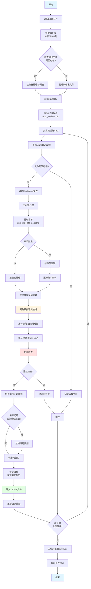

# PaperQAGenerator v9.3 - 智能比例控制版本

## 📋 项目简介

PaperQAGenerator 是一个从学术论文（Markdown格式）自动生成高质量问答对（QA）的智能系统。该系统专为农业与生命科学领域设计，支持两阶段推理链生成，能够自动从论文中提取知识并生成可用于大模型SFT训练的问答对。

### 核心特性

- ✅ **两阶段推理链生成**：所有section都使用推理链生成，确保问答对具有逻辑推理过程
- ✅ **智能比例控制**：自动控制编号问题的比例（默认最多10%），平衡简洁性与复杂性
- ✅ **高质量过滤**：多维度质量检查，过滤不符合要求的问答对
- ✅ **批量处理**：支持从Excel文件批量读取ID列表，并发处理多篇论文
- ✅ **实时统计**：显示处理进度、LLM调用次数、生成问答对数量等实时统计信息
- ✅ **断点续传**：支持从已有输出文件继续处理，自动跳过已处理的论文

## 🎯 主要功能模块

### 1. LLM调用模块
- 集成Anthropic Responses API和OpenAI Chat Completions API
- 支持多种模型（gpt-5.1、gpt-oss-120b等）
- 自动提取思维链（CoT）内容
- 线程安全的调用计数器

### 2. 文本预处理模块
- 从Markdown论文中智能提取章节
- 自动识别并跳过论文标题、参考文献等无关内容
- 支持章节合并和优先级排序
- 基础文本清洗（删除图片、表格、公式等）

### 3. 两阶段推理链生成模块
- **第一阶段**：从章节文本抽取推理链（3-7个逻辑步骤）
- **第二阶段**：将推理链转化为需要多步推理的问答对
- 所有section都使用推理链生成，确保问答对具有推理过程

### 4. 编号问题比例控制模块
- 智能控制编号问题（①②③等）的比例（默认最多10%）
- 对编号问题进行严格质量检查：
  - 问题长度不超过250字符
  - 编号点不超过2个
  - 每个编号点内容不超过20字符
  - 不使用冗余引导词

### 5. 智能质量过滤模块
- 违禁短语检测（如"文中指出"、"本文认为"等）
- 研究依赖性检查（避免依赖特定论文的表述）
- 作者信息过滤
- 假设/已知条件数量检查
- 答案复述问题检查
- 未提及具体案例检查

### 6. 文件处理模块
- 从Excel文件读取ID列表（支持AL列和AM列）
- 支持相对路径查找
- 自动在多个搜索路径中查找Markdown文件
- 生成未找到文件的汇总报告

### 7. 质量控制模块
- 难度分级（easy/medium/hard）
- 标签分类（concept、mechanism、method、result等）
- 智能采样策略（按难度配比和标签多样性）

## 📦 系统要求

- Python 3.7+
- 依赖包：
  - `pandas` - Excel文件处理
  - `openai` - LLM API调用
  - `python-dotenv` - 环境变量管理

## ⚙️ 安装和配置

### 1. 安装依赖

### 安装

```bash
# 使用 uv 安装依赖（推荐）
uv sync

# 或使用 pip
pip install -r requirements.txt
```

### 2. 环境配置

在脚本同目录下创建 `.env` 文件，配置API密钥：

```env
OPENAI_API_KEY=${OPENAI_API_KEY}
API_BASE_URL=https://api.openai.com/v1  # 可选，默认使用OpenAI标准端点
```

### 3. 配置搜索路径

在脚本中修改 `SEARCH_BASE_PATHS` 变量，设置Markdown文件的搜索路径：

```python
SEARCH_BASE_PATHS = [
    "data/pubmed_nxml_md",
    "data/crawl4ai",
    "data/sci_hub_md",
]
```

## 🚀 使用方法

### 快速开始（使用示例数据）

```bash
uv run python PaperQAGenerator_v9.3.py --search-paths examples/
```

### 基本用法

1. **准备Excel文件**
   - Excel文件需要包含AL列（第38列）和AM列（第39列）
   - AL列和AM列可以包含文件ID或相对路径
   - B列（第2列）可以包含物种信息（可选）

2. **修改主程序配置**

在脚本的 `if __name__ == "__main__":` 部分修改以下参数：

```python
excel_path = "/path/to/your/excel.xlsx"  # Excel文件路径
output_jsonl = "/path/to/output.jsonl"   # 输出JSONL文件路径
not_found_file = "/path/to/not_found.txt"  # 未找到文件列表
max_q_per_section = 5  # 每个章节生成的问题数
```

3. **运行脚本**

```bash
python PaperQAGenerator_v9.3.py
```

### 参数说明

| 参数 | 说明 | 默认值 |
|------|------|--------|
| `excel_path` | Excel文件路径（包含ID列表） | - |
| `output_jsonl` | 输出JSONL文件路径 | - |
| `not_found_file` | 未找到文件的ID列表文件 | - |
| `not_found_excel` | 未找到文件的Excel汇总 | - |
| `max_q_per_section` | 每个章节生成的最大问题数 | 5 |
| `by_section` | 是否按章节处理 | True |
| `model` | 使用的LLM模型 | gpt-5.1 |
| `max_workers` | 最大并发线程数 | 64 |

### 高级配置

#### 修改编号问题比例

在脚本中修改 `MAX_NUMBERED_RATIO` 变量：

```python
MAX_NUMBERED_RATIO = 0.1  # 默认10%，可调整为0.05（5%）或0.2（20%）
```

#### 修改章节长度限制

```python
MAX_SECTION_LENGTH = 200  # 最大章节长度
MIN_SECTION_LENGTH_FOR_PROCESSING = 200  # 最小处理长度
```

#### 修改过生成因子

```python
OVER_GENERATE_FACTOR = 1.5  # 过生成因子，用于后续采样
```

## 📤 输出格式

### JSONL格式

每行一个JSON对象，包含以下字段：

```json
{
  "species": "物种信息",
  "paper_id": "论文ID",
  "question": "问题内容",
  "answer": "答案内容",
  "reasoning_steps": ["Step 1: ...", "Step 2: ..."],  // 第一阶段推理链
  "question_cot": "完整的推理过程描述",  // 第二阶段推理链
  "final_conclusion": "最终结论",
  "difficulty": "easy|medium|hard",
  "tags": ["concept", "mechanism", ...],
  "created_at": "2025-12-15T10:30:00",
  "token_est_question": 50,
  "token_est_answer": 200,
  "section": "章节名称",
  "context": "章节原始文本",
  "Thinking模式": "high",
  "generation_type": "推理型"
}
```

### 输出文件说明

- **output.jsonl**：生成的问答对（JSONL格式）
- **not_found_ids.txt**：未找到文件的ID列表
- **not_found_ids.xlsx**：未找到文件的Excel汇总（包含原始Excel中的完整行信息）

## 🔍 质量控制规则

### 违禁短语

系统会自动检测并过滤包含以下违禁短语的问答对：
- "文中指出"、"本文认为"、"该研究表明"等指代论文的表述
- "作者认为"、"作者信息"等作者相关表述
- "根据给定内容"、"根据文本内容"等依赖文本的表述

### 编号问题限制

包含编号的问题需要满足：
- 问题长度 ≤ 250字符
- 编号点数量 ≤ 2个
- 每个编号点内容 ≤ 20字符
- 不使用"已知："、"基于以下信息："等冗余引导词

### 假设/已知条件限制

- 条件句数量 ≤ 1个
- 分号+冒号总计 ≤ 3个
- 引导词数量 ≤ 2个
- 不能以条件句开头

## 📊 实时统计

运行时会显示实时统计信息（每60秒更新一次）：

```
📊 实时统计 | 运行时长: 01:23:45 | LLM调用: 1234 次 | 已处理论文: 50 篇 | 问答对总数: 250 个
```

## 🔄 断点续传

系统支持断点续传功能：

1. 如果输出JSONL文件已存在，系统会自动读取已处理的paper_id
2. 在本次运行中自动跳过已处理的论文
3. 如果未找到文件列表已存在，也会自动跳过这些ID的文件查找

## ⚠️ 注意事项

1. **API限流**：大量并发请求可能导致API限流，建议根据实际情况调整 `max_workers` 参数
2. **文件路径**：确保Excel文件中的路径格式正确，支持相对路径和绝对路径
3. **内存使用**：处理大量论文时可能占用较多内存，建议监控系统资源
4. **网络连接**：需要稳定的网络连接以调用LLM API

## 🐛 常见问题

### Q: 为什么有些论文没有生成问答对？

A: 可能的原因：
- 论文内容过短（少于200字符）
- 章节被跳过（如参考文献、致谢等）
- 生成的问答对未通过质量检查
- 文件未找到

### Q: 如何调整生成的问题数量？

A: 修改 `max_q_per_section` 参数。注意：系统会过生成（乘以 `OVER_GENERATE_FACTOR`），然后进行采样，最终数量可能略少于设定值。

### Q: 编号问题比例如何控制？

A: 系统会自动控制编号问题的比例，通过 `is_acceptable_numbered_question()` 函数进行严格检查。如需调整比例，修改 `MAX_NUMBERED_RATIO` 变量。

### Q: 如何处理未找到的文件？

A: 系统会自动生成 `not_found_ids.txt` 和 `not_found_ids.xlsx` 文件，包含所有未找到文件的ID和相关信息。

## 📝 版本历史

- **v9.5** (2025-12-15): 智能比例控制版本
  - 新增编号问题比例控制（默认10%）
  - 优化编号问题质量检查
  - 实时统计编号问题比例

- **v9.4**: 取消推理链使用次数限制，所有section都使用推理链生成

- **v9.3**: 两阶段推理链生成版本

## 👥 作者

Claude Code

## 📄 许可证

本项目仅供内部使用。

---

## 📈 系统流程图



### 流程图说明

1. **输入阶段**：从Excel文件读取ID列表，支持断点续传
2. **文件查找**：在多个搜索路径中查找Markdown文件
3. **文本处理**：提取章节，进行文本清洗
4. **问答生成**：使用两阶段推理链生成问答对
5. **质量控制**：多维度质量检查和编号问题比例控制
6. **输出阶段**：写入JSONL文件，生成统计报告

### 关键模块说明

- **两阶段推理链生成**：先抽取推理链，再转化为问答对
- **质量检查**：违禁短语、研究依赖性、编号问题限制等
- **智能采样**：按难度配比和标签多样性进行采样
- **并发处理**：使用线程池并发处理多篇论文，提高效率
