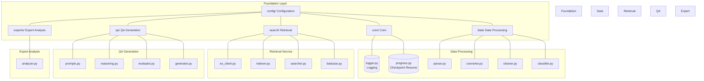
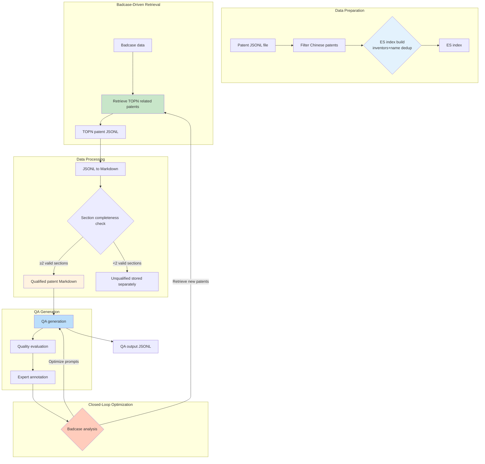
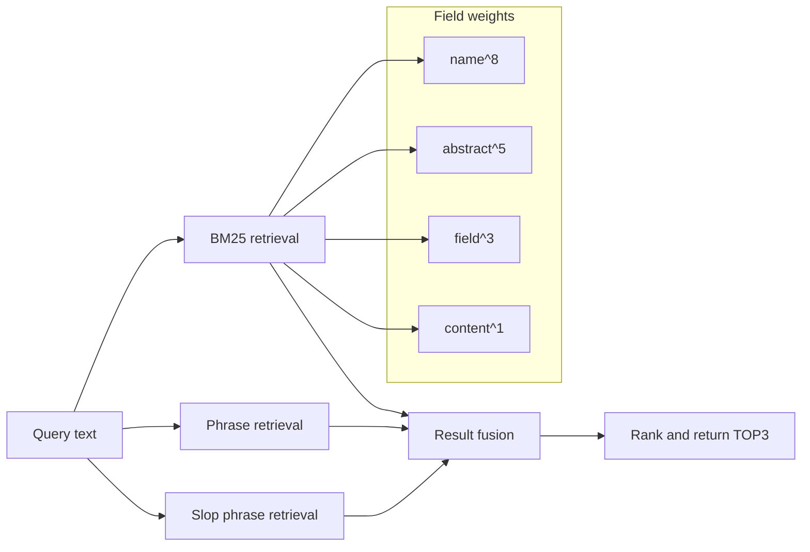
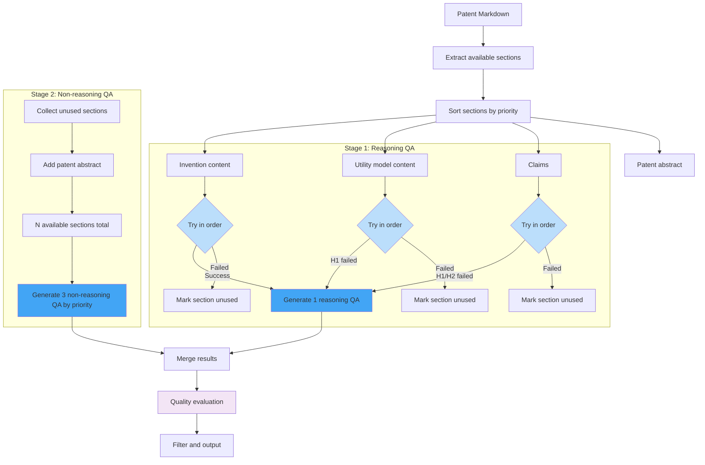

# PatentQASystem - Patent QA Pair Generation System

<div align="center">

**Modular Patent SFT Data Intelligent Generation System**

[](https://www.python.org/downloads/)
[](https://opensource.org/licenses/MIT)

</div>

## Table of Contents

- [Overview](#overview)
- [System Architecture](#system-architecture)
- [Core Modules](#core-modules)
- [Data Pipeline](#data-pipeline)
- [Installation and Configuration](#installation-and-configuration)
- [Quick Start](#quick-start)
- [API Documentation](#api-documentation)
- [Project Structure](#project-structure)
- [License](#license)
- [Contact](#contact)

---

## Overview

PatentQASystem is a **modular patent QA pair (SFT training data) intelligent generation system** focused on agricultural patents. It implements a fully automated pipeline from patent documents to high-quality QA pairs. The core innovation is an **"evaluation-feedback-retrieval-generation" closed loop** that continuously optimizes QA generation quality through badcase-driven improvement.

### Core Capabilities

| Capability | Description |
|------|------|
| Data processing | JSONL and Markdown format conversion, automatic classification by IPC |
| Patent retrieval | Elasticsearch-based hybrid retrieval (BM25 + phrase matching) |
| QA generation | Two-stage reasoning chain generation, supports reasoning / non-reasoning QA |
| Quality evaluation | Multi-dimensional QA quality evaluation and hallucination detection |
| Badcase analysis | Expert feedback analysis, badcase-driven retrieval |
| Checkpoint resume | Supports interruption recovery and high-concurrency processing |

---

## System Architecture

### System Architecture Diagram



---

## Core Modules

### 1. Configuration Module (config/)

Centrally manages all system configuration items.

```python
from PatentQASystem import config

cfg = config.load_config()
print(f"ES host: {cfg.ES_HOST}")
print(f"Max concurrency: {cfg.MAX_CONCURRENT}")
```

**Files included**:
- `settings.py` - Config class
- `constants.py` - Agricultural keywords, forbidden words, constant definitions

### 2. Core Module (core/)

Provides logging and checkpoint resume functionality.

| Component | Function |
|------|------|
| `logger.py` | Independent logging configuration, supports file and console output |
| `progress.py` | Checkpoint resume management, records processing progress |

### 3. Data Processing Module (data/)

Handles patent data parsing, cleaning, conversion, and classification.

| Component | Function |
|------|------|
| `parser.py` | Parse JSONL-format patent data |
| `converter.py` | Convert patent JSON to Markdown format |
| `cleaner.py` | Clean text, remove forbidden phrases |
| `classifier.py` | Classify patents by IPC category |

### 4. Retrieval Module (search/)

Provides Elasticsearch connection, index building, and patent retrieval.

```python
from PatentQASystem.search import PatentSearcher

searcher = PatentSearcher()
result = searcher.search_top3("crop yield improvement technology")
```

| Component | Function |
|------|------|
| `es_client.py` | Elasticsearch client wrapper |
| `indexer.py` | Create and manage patent indexes |
| `searcher.py` | Multiple retrieval strategies (BM25, Phrase, hybrid retrieval) |
| `badcase.py` | Retrieve related patents based on badcases |

### 5. QA Generation Module (qa/)

Provides reasoning chain extraction, QA generation, and quality evaluation.

```python
from PatentQASystem.qa import QAGenerator, QAEvaluator

# Generate QA
generator = QAGenerator()
qa_list = generator.generate_from_patent(md_content, patent_id)

# Quality evaluation
evaluator = QAEvaluator()
result = evaluator.evaluate_sync(question, answer, patent_content)
```

| Component | Function |
|------|------|
| `prompts.py` | Prompt template management |
| `reasoning.py` | Extract technical reasoning chains from patent sections |
| `evaluator.py` | Multi-dimensional QA quality evaluation |
| `generator.py` | Patent QA pair generator |

### 6. Expert Feedback Module (experts/)

Analyzes expert annotation data and identifies badcases.

```python
from PatentQASystem.experts import ExpertFeedbackAnalyzer

analyzer = ExpertFeedbackAnalyzer()
results = analyzer.analyze_all(annotations)
report = analyzer.generate_report(results)
```

| Component | Function |
|------|------|
| `analyzer.py` | Expert feedback analysis and badcase analysis |

### 7. CLI Entry Point (cli/)

Provides command-line interface.

```bash
# Import patent data
python -m cli.main import-patents --input patents.jsonl --index patents_cn

# Search patents
python -m cli.main search --query "how to improve crop yield"

# Generate QA
python -m cli.main generate --input patents_md/ --output qa_output/
```

---

## Data Pipeline

### Complete Data Pipeline Diagram



**Pipeline description**:

1. **Data preparation**
   - Filter Chinese patents
   - Build ES index (deduplicate by inventors+name)

2. **Badcase-driven retrieval**
   - Retrieve TOPN related patents based on badcases

3. **Data processing**
   - Convert TOPN patent JSONL to Markdown
   - Section completeness check (≥2 valid sections)
   - Qualified patents proceed to QA generation

4. **QA generation**
   - Generate QA pairs
   - Quality evaluation
   - Expert annotation

5. **Closed-loop optimization**
   - Badcase analysis
   - Optimize prompts (return to QA generation stage)
   - Retrieve new patents (return to badcase-driven retrieval stage)

### Retrieval Strategy Flow



### QA Generation Strategy



**Generation strategy description**:

1. **Reasoning QA generation** (1 question)
   - Priority order: Invention content → Utility model content → Claims
   - The first successful section generates 1 reasoning QA
   - Failed sections are marked as "unused"

2. **Non-reasoning QA generation** (3 questions)
   - Collect sections unused by reasoning QA
   - Add patent abstract as a fallback
   - Generate 3 non-reasoning QA from all available sections by priority

```

---

## Installation and Configuration

### Requirements

- Python 3.8+
- Elasticsearch 8.0+
- 4GB RAM+

### Installation

```bash
# Clone the project
git clone https://github.com/your-repo/PatentQASystem.git
cd PatentQASystem

# Install dependencies with uv (recommended)
uv sync

# Or use pip
pip install -e .
```

### Environment Variables

```bash
# Copy environment variable template
cp .env.example .env

# Edit configuration
vim .env
```

```bash
# .env example configuration
OPENAI_API_KEY=${OPENAI_API_KEY}
OPENAI_BASE_URL=${OPENAI_BASE_URL:-https://api.openai.com/v1}
MODEL=gpt-5.1

ES_HOST=localhost:9200
ES_USER=elastic
ES_PWD=${ES_PASSWORD}
ES_INDEX_NAME=patents_cn

MAX_CONCURRENT=32
BATCH_SIZE=100
```

### Configuration Reference

| Setting | Description | Default |
|--------|------|--------|
| `OPENAI_API_KEY` | OpenAI API key | - |
| `OPENAI_BASE_URL` | API base URL | https://api.openai.com/v1 |
| `MODEL` | Model name | gpt-4 |
| `ES_HOST` | Elasticsearch host | localhost:9200 |
| `ES_INDEX_NAME` | Index name | patents_cn |
| `MAX_CONCURRENT` | Maximum concurrency | 32 |
| `BATCH_SIZE` | Batch size | 100 |
| `MAX_Q_PER_PATENT` | Maximum QA per patent | 4 |

---

## Quick Start

### 1. Import Patent Data

```bash
python -m cli.main import-patents \
    --input patents.jsonl \
    --index patents_cn \
    --chunk-size 500
```

### 2. Search Related Patents

```bash
python -m cli.main search \
    --query "how to improve crop yield" \
    --top-k 3
```

**Example output**:
```
[1] An agricultural method for improving crop yield (score: 18.5)
    ID: 123456

[2] Crop yield enhancement planting technology (score: 15.2)
    ID: 789012

[3] High-yield crop cultivation management plan (score: 12.8)
    ID: 345678
```

### 3. Generate QA Pairs

```bash
python -m cli.main generate \
    --input patents_md/ \
    --output qa_output/ \
    --max-concurrent 32 \
    --max-qa 4
```

### 4. Analyze Badcases

```bash
python -m cli.main analyze-badcases \
    --input expert_annotations.json \
    --output analysis_results/
```

### 5. Quick Test with Sample Data

```bash
uv run python -m cli.main generate --input examples/ --output output/
```

### 6. Run Full Pipeline

```bash
python -m cli.main run-all \
    --input patents.jsonl \
    --output qa_output/
```

---

## API Documentation

For detailed API documentation, see the `docs/` directory:

| Document | Content |
|------|------|
| `docs/API_CONFIG.md` | Configuration module API |
| `docs/API_DATA.md` | Data processing module API |
| `docs/API_SEARCH.md` | Retrieval module API |
| `docs/API_QA.md` | QA generation module API |
| `docs/API_EXPERTS.md` | Expert feedback module API |
| `docs/CLI_USAGE.md` | CLI usage guide |
| `docs/EXAMPLE.md` | Complete usage example |

### Programmatic Usage Example

```python
from PatentQASystem import config, data, search, qa, experts

# 1. Load configuration
cfg = config.load_config()

# 2. Parse patents
parser = data.PatentParser()
patents = parser.parse_file("patents.jsonl")

# 3. Convert to Markdown
converter = data.MarkdownConverter()
md = converter.convert(patent)

# 4. ES retrieval
searcher = search.PatentSearcher()
result = searcher.search_top3("crop yield improvement")

# 5. Generate QA
generator = qa.QAGenerator()
qa_list = generator.generate_from_patent(md, patent_id)

# 6. Quality evaluation
evaluator = qa.QAEvaluator()
result = evaluator.evaluate_sync(question, answer, patent_content)

# 7. Badcase analysis
analyzer = experts.ExpertFeedbackAnalyzer()
results = analyzer.analyze_all(annotations)
```

---


---

## Project Structure

```
PatentQASystem/
├── PatentQASystem/          # Main package
│   ├── __init__.py          # Package initialization
│   ├── config/              # Configuration module
│   │   ├── __init__.py
│   │   ├── settings.py      # Config class
│   │   └── constants.py     # Constant definitions
│   ├── core/                # Core module
│   │   ├── __init__.py
│   │   ├── logger.py        # Logging system
│   │   └── progress.py      # Checkpoint resume
│   ├── data/                # Data processing module
│   │   ├── __init__.py
│   │   ├── parser.py        # Data parsing
│   │   ├── converter.py     # Format conversion
│   │   ├── cleaner.py       # Text cleaning
│   │   └── classifier.py    # Classification
│   ├── search/              # Retrieval module
│   │   ├── __init__.py
│   │   ├── es_client.py     # ES client
│   │   ├── indexer.py       # Index building
│   │   ├── searcher.py      # Retrieval strategies
│   │   └── badcase.py       # Badcase retrieval
│   ├── qa/                  # QA generation module
│   │   ├── __init__.py
│   │   ├── prompts.py       # Prompt templates
│   │   ├── reasoning.py     # Reasoning chain extraction
│   │   ├── evaluator.py     # Quality evaluation
│   │   └── generator.py     # QA generator
│   ├── experts/             # Expert feedback module
│   │   ├── __init__.py
│   │   └── analyzer.py      # Badcase analysis
│   ├── utils/               # Utilities module
│   │   └── __init__.py
│   └── cli/                 # Command-line interface
│       ├── __init__.py
│       └── main.py          # Main entry point
├── docs/                    # API documentation
│   ├── API_CONFIG.md
│   ├── API_DATA.md
│   ├── API_SEARCH.md
│   ├── API_QA.md
│   ├── API_EXPERTS.md
│   ├── CLI_USAGE.md
│   └── EXAMPLE.md
├── tests/                   # Test directory
├── pyproject.toml           # Project configuration
├── requirements.txt         # Dependency list
├── .env.example             # Environment variable template
└── README.md                # Project documentation
```

---

## License

MIT License

---

## Contact

For questions or suggestions, please submit an Issue or Pull Request.
