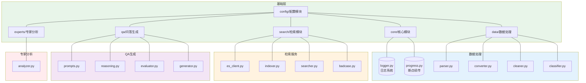
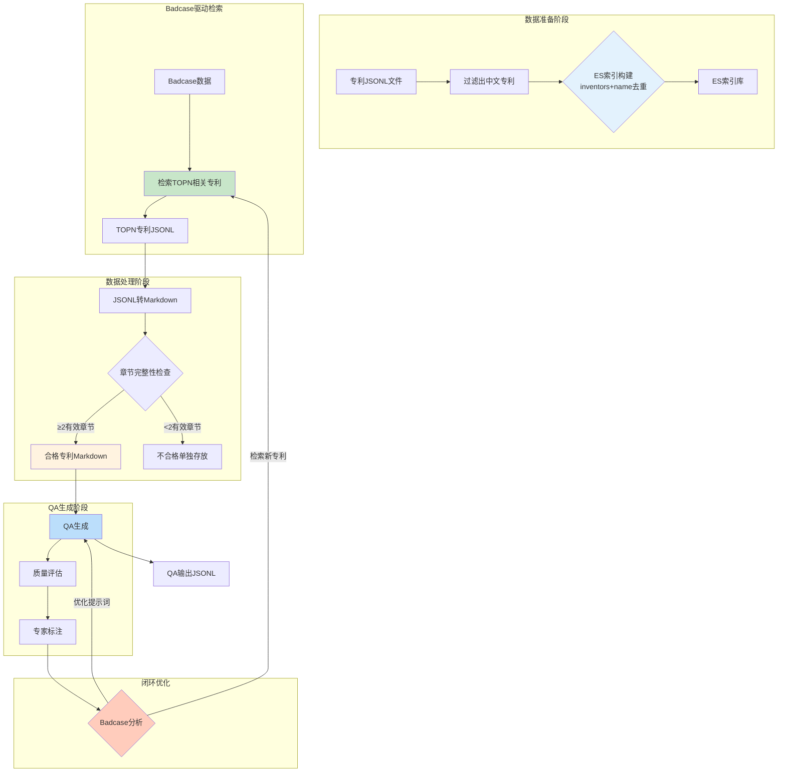
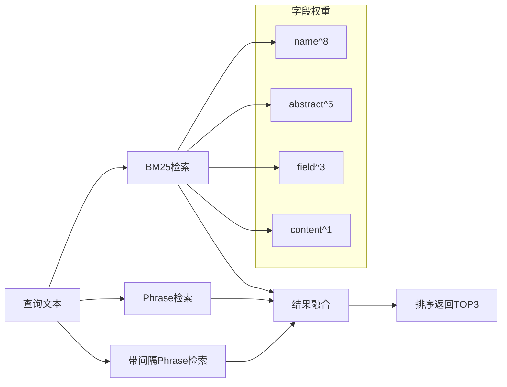
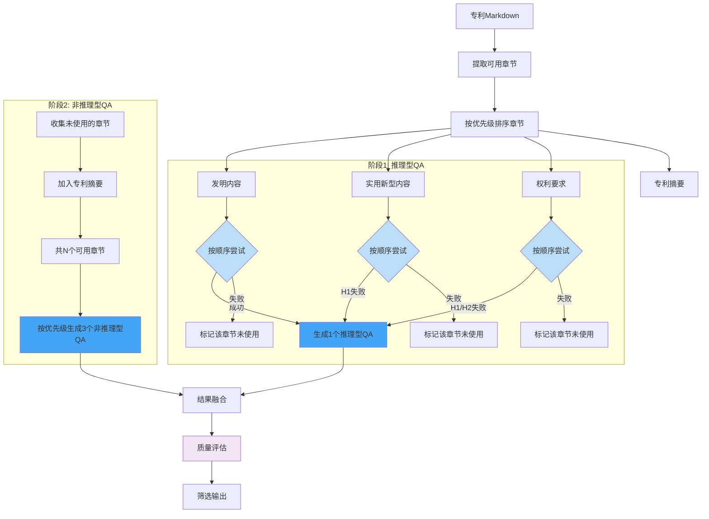

# PatentQASystem - 专利问答对生成系统

<div align="center">

**模块化专利SFT数据智能生成系统**

[](https://www.python.org/downloads/)
[](https://opensource.org/licenses/MIT)

</div>

## 目录

- [概述](#概述)
- [系统架构](#系统架构)
- [核心模块](#核心模块)
- [数据流程](#数据流程)
- [创新点](#创新点)
- [安装与配置](#安装与配置)
- [快速开始](#快速开始)
- [API文档](#api文档)
- [扩展开发](#扩展开发)
- [许可证](#许可证)

---

## 概述

PatentQASystem 是一个**模块化的专利问答对（SFT训练数据）智能生成系统**，专注于农业领域专利，实现了从专利文档到高质量QA对的全自动化生产流程。系统的核心创新在于建立了**"评测-反馈-检索-生成"闭环**，通过badcase驱动的方式持续优化QA生成质量。

### 核心能力

| 能力 | 描述 |
|------|------|
| 数据处理 | JSONL与Markdown格式转换，按IPC分类自动归类 |
| 专利检索 | 基于Elasticsearch的混合检索（BM25+短语匹配） |
| QA生成 | 两阶段推理链生成，支持推理型/非推理型QA |
| 质量评估 | 多维度QA质量评估与幻觉检测 |
| Badcase分析 | 专家反馈分析，badcase驱动检索 |
| 断点续传 | 支持中断恢复，高并发处理 |

---

## 系统架构

### 系统架构图



---

## 核心模块

### 1. 配置模块 (config/)

集中管理系统所有配置项。

```python
from PatentQASystem import config

cfg = config.load_config()
print(f"ES主机: {cfg.ES_HOST}")
print(f"最大并发: {cfg.MAX_CONCURRENT}")
```

**包含文件**：
- `settings.py` - Config配置类
- `constants.py` - 农业关键词、违禁词、常量定义

### 2. 核心模块 (core/)

提供日志系统和断点续传功能。

| 组件 | 功能 |
|------|------|
| `logger.py` | 独立日志配置，支持文件和控制台输出 |
| `progress.py` | 断点续传管理，记录处理进度 |

### 3. 数据处理模块 (data/)

负责专利数据的解析、清洗、转换和分类。

| 组件 | 功能 |
|------|------|
| `parser.py` | 解析JSONL格式专利数据 |
| `converter.py` | 将专利JSON转换为Markdown格式 |
| `cleaner.py` | 清洗文本，移除禁用短语 |
| `classifier.py` | 按IPC分类对专利进行分类 |

### 4. 检索模块 (search/)

提供Elasticsearch连接、索引构建和专利检索功能。

```python
from PatentQASystem.search import PatentSearcher

searcher = PatentSearcher()
result = searcher.search_top3("作物产量提高技术")
```

| 组件 | 功能 |
|------|------|
| `es_client.py` | Elasticsearch客户端封装 |
| `indexer.py` | 创建和管理专利索引 |
| `searcher.py` | 多种检索策略（BM25、Phrase、混合检索） |
| `badcase.py` | 基于badcase检索相关专利 |

### 5. QA生成模块 (qa/)

提供推理链抽取、QA生成和质量评估功能。

```python
from PatentQASystem.qa import QAGenerator, QAEvaluator

# 生成QA
generator = QAGenerator()
qa_list = generator.generate_from_patent(md_content, patent_id)

# 质量评估
evaluator = QAEvaluator()
result = evaluator.evaluate_sync(question, answer, patent_content)
```

| 组件 | 功能 |
|------|------|
| `prompts.py` | 提示词模板管理 |
| `reasoning.py` | 从专利章节抽取技术推理链 |
| `evaluator.py` | 多维度QA质量评估 |
| `generator.py` | 专利问答对生成器 |

### 6. 专家反馈模块 (experts/)

分析专家标注数据，识别badcase。

```python
from PatentQASystem.experts import ExpertFeedbackAnalyzer

analyzer = ExpertFeedbackAnalyzer()
results = analyzer.analyze_all(annotations)
report = analyzer.generate_report(results)
```

| 组件 | 功能 |
|------|------|
| `analyzer.py` | 专家反馈分析和badcase分析 |

### 7. CLI入口 (cli/)

提供命令行接口。

```bash
# 导入专利数据
python -m cli.main import-patents --input patents.jsonl --index patents_cn

# 检索专利
python -m cli.main search --query "如何提高作物产量"

# 生成QA
python -m cli.main generate --input patents_md/ --output qa_output/
```

---

## 数据流程

### 完整数据流程图



**流程说明**：

1. **数据准备阶段**
   - 过滤出中文专利
   - 构建ES索引（基于inventors+name去重）

2. **Badcase驱动检索**
   - 根据badcase检索TOPN相关专利

3. **数据处理阶段**
   - TOPN专利JSONL转换为Markdown
   - 章节完整性检查（≥2个有效章节）
   - 合格专利进入QA生成

4. **QA生成阶段**
   - 生成QA对
   - 质量评估
   - 专家标注

5. **闭环优化**
   - Badcase分析
   - 优化提示词（返回QA生成阶段）
   - 检索新专利（返回Badcase驱动检索阶段）

### 检索策略流程



### QA生成策略



**生成策略说明**：

1. **推理型QA生成**（1个）
   - 按优先级顺序：发明内容 → 实用新型内容 → 权利要求
   - 第一个成功的章节生成1个推理型QA
   - 失败的章节标记为"未使用"

2. **非推理型QA生成**（3个）
   - 收集推理型QA未使用的章节
   - 加入专利摘要作为备选
   - 从所有可用章节中按优先级生成3个非推理型QA

```

---

## 安装与配置

### 环境要求

- Python 3.8+
- Elasticsearch 8.0+
- 4GB RAM+

### 安装

```bash
# 克隆项目
git clone https://github.com/your-repo/PatentQASystem.git
cd PatentQASystem

# 使用 uv 安装依赖（推荐）
uv sync

# 或使用 pip
pip install -e .
```

### 配置环境变量

```bash
# 复制环境变量模板
cp .env.example .env

# 编辑配置
vim .env
```

```bash
# .env 示例配置
OPENAI_API_KEY=${OPENAI_API_KEY}
OPENAI_BASE_URL=${OPENAI_BASE_URL:-https://api.openai.com/v1}
MODEL=gpt-5.1

ES_HOST=localhost:9200
ES_USER=elastic
ES_PWD=${ES_PASSWORD}
ES_INDEX_NAME=patents_cn

MAX_CONCURRENT=32
BATCH_SIZE=100
```

### 配置项说明

| 配置项 | 说明 | 默认值 |
|--------|------|--------|
| `OPENAI_API_KEY` | OpenAI API密钥 | - |
| `OPENAI_BASE_URL` | API基础URL | https://api.openai.com/v1 |
| `MODEL` | 模型名称 | gpt-4 |
| `ES_HOST` | Elasticsearch主机 | localhost:9200 |
| `ES_INDEX_NAME` | 索引名 | patents_cn |
| `MAX_CONCURRENT` | 最大并发数 | 32 |
| `BATCH_SIZE` | 批次大小 | 100 |
| `MAX_Q_PER_PATENT` | 每专利最大QA数 | 4 |

---

## 快速开始

### 1. 导入专利数据

```bash
python -m cli.main import-patents \
    --input patents.jsonl \
    --index patents_cn \
    --chunk-size 500
```

### 2. 检索相关专利

```bash
python -m cli.main search \
    --query "如何提高作物产量" \
    --top-k 3
```

**输出示例**：
```
[1] 一种提高作物产量的农业方法 (分数: 18.5)
    ID: 123456

[2] 作物增产增效的种植技术 (分数: 15.2)
    ID: 789012

[3] 高产作物栽培管理方案 (分数: 12.8)
    ID: 345678
```

### 3. 生成QA对

```bash
python -m cli.main generate \
    --input patents_md/ \
    --output qa_output/ \
    --max-concurrent 32 \
    --max-qa 4
```

### 4. 分析badcase

```bash
python -m cli.main analyze-badcases \
    --input expert_annotations.json \
    --output analysis_results/
```

### 5. 使用示例数据快速测试

```bash
uv run python -m cli.main generate --input examples/ --output output/
```

### 6. 运行完整流程

```bash
python -m cli.main run-all \
    --input patents.jsonl \
    --output qa_output/
```

---

## API文档

详细API文档请参考 `docs/` 目录：

| 文档 | 内容 |
|------|------|
| `docs/API_CONFIG.md` | 配置模块API |
| `docs/API_DATA.md` | 数据处理模块API |
| `docs/API_SEARCH.md` | 检索模块API |
| `docs/API_QA.md` | QA生成模块API |
| `docs/API_EXPERTS.md` | 专家反馈模块API |
| `docs/CLI_USAGE.md` | CLI使用说明 |
| `docs/EXAMPLE.md` | 完整使用示例 |

### 编程方式使用示例

```python
from PatentQASystem import config, data, search, qa, experts

# 1. 加载配置
cfg = config.load_config()

# 2. 解析专利
parser = data.PatentParser()
patents = parser.parse_file("patents.jsonl")

# 3. 转换为Markdown
converter = data.MarkdownConverter()
md = converter.convert(patent)

# 4. ES检索
searcher = search.PatentSearcher()
result = searcher.search_top3("作物产量提高")

# 5. 生成QA
generator = qa.QAGenerator()
qa_list = generator.generate_from_patent(md, patent_id)

# 6. 质量评估
evaluator = qa.QAEvaluator()
result = evaluator.evaluate_sync(question, answer, patent_content)

# 7. Badcase分析
analyzer = experts.ExpertFeedbackAnalyzer()
results = analyzer.analyze_all(annotations)
```

---


---

## 项目结构

```
PatentQASystem/
├── PatentQASystem/          # 主包
│   ├── __init__.py          # 包初始化
│   ├── config/              # 配置模块
│   │   ├── __init__.py
│   │   ├── settings.py      # 配置类
│   │   └── constants.py     # 常量定义
│   ├── core/                # 核心模块
│   │   ├── __init__.py
│   │   ├── logger.py        # 日志系统
│   │   └── progress.py      # 断点续传
│   ├── data/                # 数据处理模块
│   │   ├── __init__.py
│   │   ├── parser.py        # 数据解析
│   │   ├── converter.py     # 格式转换
│   │   ├── cleaner.py       # 文本清洗
│   │   └── classifier.py    # 分类处理
│   ├── search/              # 检索模块
│   │   ├── __init__.py
│   │   ├── es_client.py     # ES客户端
│   │   ├── indexer.py       # 索引构建
│   │   ├── searcher.py      # 检索策略
│   │   └── badcase.py       # Badcase检索
│   ├── qa/                  # 问答生成模块
│   │   ├── __init__.py
│   │   ├── prompts.py       # 提示词模板
│   │   ├── reasoning.py     # 推理链抽取
│   │   ├── evaluator.py     # 质量评估
│   │   └── generator.py     # QA生成器
│   ├── experts/             # 专家反馈模块
│   │   ├── __init__.py
│   │   └── analyzer.py      # Badcase分析
│   ├── utils/               # 工具模块
│   │   └── __init__.py
│   └── cli/                 # 命令行接口
│       ├── __init__.py
│       └── main.py          # 主程序
├── docs/                    # API文档
│   ├── API_CONFIG.md
│   ├── API_DATA.md
│   ├── API_SEARCH.md
│   ├── API_QA.md
│   ├── API_EXPERTS.md
│   ├── CLI_USAGE.md
│   └── EXAMPLE.md
├── tests/                   # 测试目录
├── pyproject.toml           # 项目配置
├── requirements.txt         # 依赖列表
├── .env.example             # 环境变量模板
└── README.md                # 项目说明
```

---

## 许可证

MIT License

---

## 联系方式

如有问题或建议，请提交Issue或Pull Request。
