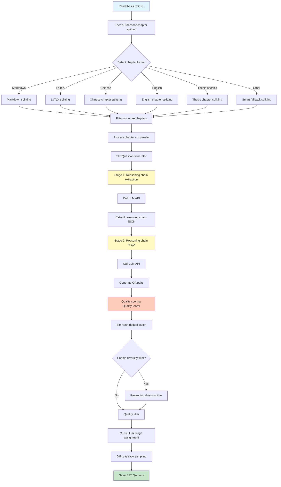
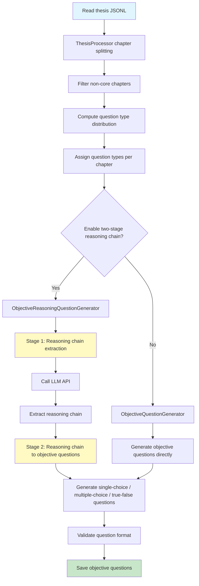
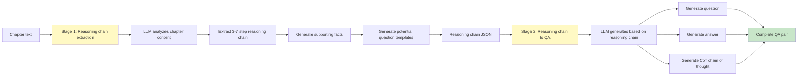
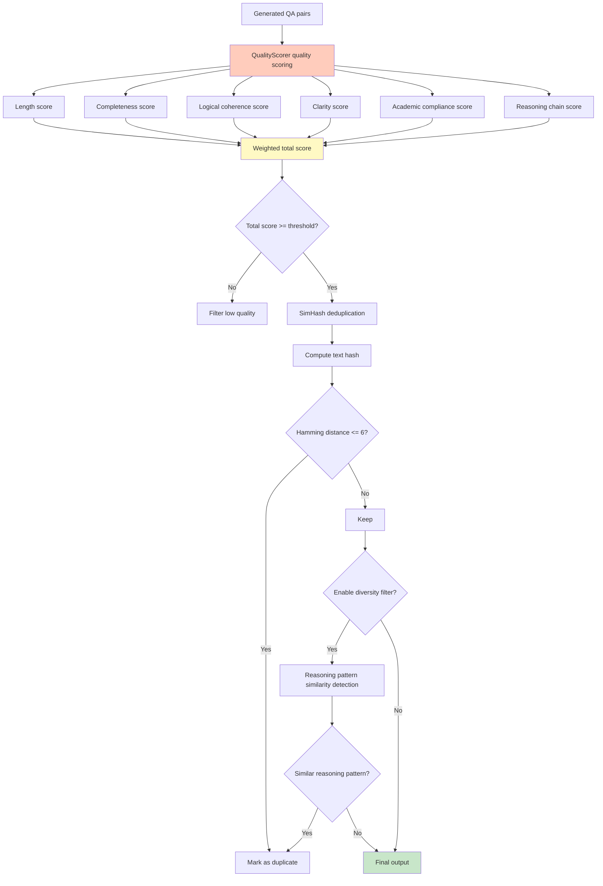
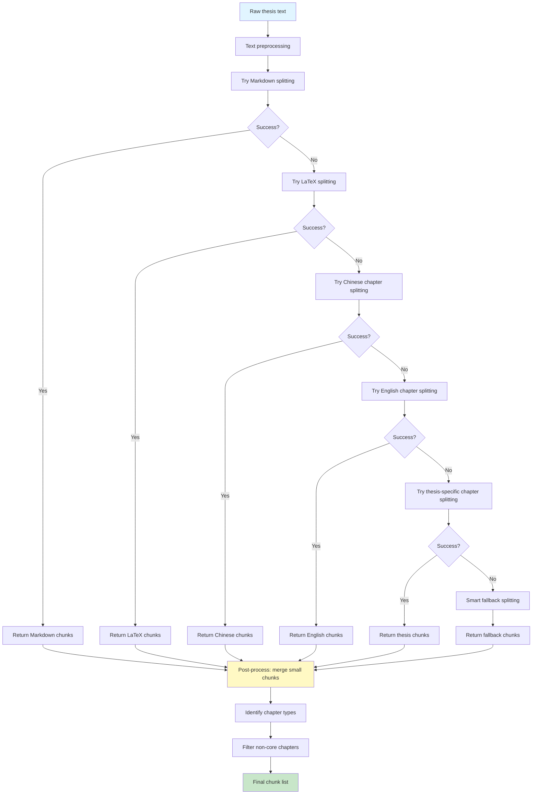

# Thesis SFT QA Pair Generator

## Project Overview

`demo_thesis_QA_genrator_v2.py` is an SFT (Supervised Fine-Tuning) QA pair generator designed specifically for academic theses. This tool automatically reads thesis text, splits it by chapter, and generates high-quality QA pairs suitable for large-model SFT training.

## System Flowcharts

### SFT QA Pair Generation Flow



### Objective Question Generation Flow



### Two-Stage Reasoning Chain Generation (Detailed)



### Quality Evaluation and Filtering Flow



### Chapter Splitting Strategy Flow



## Core Features

### 📚 Thesis Optimization
- Recognizes thesis-specific chapters (abstract, introduction, literature review, methods, results, discussion, conclusion)
- Enhanced handling of academic content
- Optimized reasoning chain generation for experimental results and discussion sections
- Supports semantic processing of figures, tables, and formulas

### 🔗 Reasoning Chain Generation
- **Two-stage reasoning chain generation**: generate the reasoning process first, then generate the answer
- **Thinking mode**: supports internal thinking process generation
- **Reasoning diversity filter** (optional): avoids similar reasoning paths

### 🎯 Multiple Question Types
- **SFT QA pairs**: standard QA format for supervised fine-tuning
- **Objective evaluation questions**:
  - Single-choice (200 questions)
  - Multiple-choice (100 questions)
  - True/false (100 questions)

### ✨ Quality Control
- **Automatic quality scoring**: evaluates the quality of generated QA pairs
- **Quality filtering**: set a minimum quality threshold to filter low-quality content
- **Deduplication**: uses SimHash algorithm for similar content deduplication

### ⚡ High Performance
- **Parallel processing**: supports multi-threaded concurrent processing
- **Caching**: caches chapter splitting results to improve efficiency
- **Cost tracking**: real-time monitoring of token usage and cost

## Install Dependencies

```bash
# Install dependencies with uv (recommended)
uv sync

# Or use pip
pip install openai python-dotenv

# Optional dependencies
pip install tqdm  # Progress bar display
pip install reasoning_diversity  # Reasoning diversity filter
```

## Environment Configuration

Create a `.env` file and configure the following environment variables:

```bash
# Required
OPENAI_API_KEY=${OPENAI_API_KEY}

# Optional
OPENAI_BASE_URL=https://api.openai.com/v1  # Default value
DEFAULT_MODEL=gpt-4o-mini  # Default model
```

## Usage

### Quick Test with Sample Data

```bash
uv run python demo_thesis_QA_genrator_v2.py \
    --input examples/sample_thesis.jsonl \
    --output output/
```

### Basic Usage

```bash
python demo_thesis_QA_genrator_v2.py \
    --input data/thesis.jsonl \
    --output output/sft_qa.jsonl \
    --max-q-per-chunk 5 \
    --workers-thesis 4 \
    --workers-chunk 10
```

### Generate Objective Evaluation Questions

```bash
python demo_thesis_QA_genrator_v2.py \
    --input data/thesis.jsonl \
    --output output/objective_qa \
    --mode objective \
    --workers-thesis 6
```

### Enable Quality Filtering

```bash
python demo_thesis_QA_genrator_v2.py \
    --input data/thesis.jsonl \
    --output output/sft_qa.jsonl \
    --enable-quality-filter \
    --min-quality-score 70.0
```

### Enable Reasoning Diversity Filtering

```bash
python demo_thesis_QA_genrator_v2.py \
    --input data/thesis.jsonl \
    --output output/sft_qa.jsonl \
    --enable-diversity-filter \
    --simhash-dedup-hamming 6
```

## Command-Line Arguments

### Basic Parameters

| Parameter | Type | Default | Description |
|------|------|--------|------|
| `--input` | string | - | **Required**. Path to input thesis JSONL file |
| `--output` | string | - | **Required**. Output file path or directory |
| `--model` | string | gpt-4o-mini | Model name to use |
| `--max-q-per-chunk` | int | 5 | Maximum number of questions per chunk |
| `--qa-per-chunk` | int | 5 | Number of questions per chapter (recommended) |

### Mode Selection

| Parameter | Description |
|------|------|
| `--mode sft` | Generate SFT QA pairs (default mode) |
| `--mode objective` | Generate objective evaluation questions |

### Parallel Processing

| Parameter | Default | Description |
|------|--------|------|
| `--workers-thesis` | 6 | Number of theses to process in parallel |
| `--workers-chunk` | 10 | Number of chapters to process in parallel per thesis |

### Quality Control

| Parameter | Default | Description |
|------|--------|------|
| `--enable-quality-filter` | False | Enable quality filtering |
| `--min-quality-score` | 70.0 | Minimum quality score threshold |
| `--enable-diversity-filter` | False | Enable reasoning diversity filtering |
| `--simhash-dedup-hamming` | 6 | SimHash deduplication Hamming distance threshold |

### Context Settings

| Parameter | Default | Description |
|------|--------|------|
| `--context-length` | 10000 | Context length limit |
| `--qa-floor` | 80 | Minimum number of QA pairs per thesis |
| `--qa-cap` | 120 | Maximum number of QA pairs per thesis |

### Thinking Mode

| Parameter | Description |
|------|------|
| `--enable-thinking` | Enable Thinking mode (on by default) |
| `--no-thinking` | Disable Thinking mode |
| `--enable-api-thinking-objective` | Enable Thinking mode for objective questions (on by default) |
| `--no-api-thinking-objective` | Disable Thinking mode for objective questions |
| `--enable-prompt-reasoning-objective` | Enable two-stage reasoning chain for objective questions (off by default) |
| `--no-prompt-reasoning-objective` | Disable two-stage reasoning chain for objective questions |

### Cost Tracking

| Parameter | Default | Description |
|------|--------|------|
| `--input-price` | 1.2500 | Input token price ($/million tokens) |
| `--output-price` | 10.0000 | Output token price ($/million tokens) |

## Input Format

The input file should be in JSONL format, with one thesis per line:

```json
{
  "id": "thesis_001",
  "text": "Full thesis content...",
  "source": "proquest_papers"
}
```

Or use the simplified format:

```json
{
  "id": "thesis_001",
  "text": "Full thesis content...",
  "label": "proquest_papers"
}
```

## Output Format

### SFT QA Pair Format

```json
{
  "question_id": "q_001",
  "chunk_id": "chunk_001",
  "chunk_title": "Chapter 1 Introduction",
  "question": "What is the research background?",
  "answer": "The research background is...",
  "context": "Context content...",
  "reasoning_chain": "Reasoning process...",
  "question_type": "open_ended",
  "source_id": "chunk_001",
  "metadata": {
    "quality_score": 85.0,
    "reasoning_diversity_score": 0.92
  }
}
```

### Objective Question Format

```json
{
  "question_id": "obj_001",
  "question_type": "single_choice",
  "question": "Which of the following is a main characteristic of machine learning?",
  "options": ["A. Rule-based", "B. Data-driven", "C. Manual programming", "D. Fixed logic"],
  "answer": "B",
  "explanation": "Machine learning is a data-driven approach...",
  "reasoning_chain": "Reasoning process...",
  "context": "Context content...",
  "chunk_id": "chunk_001",
  "chunk_title": "Chapter 1 Introduction"
}
```

## Core Classes

### 1. ThesisProcessor
Handles thesis chapter splitting and preprocessing.
- Supports chapter recognition for Markdown, LaTeX, Chinese, English, and other formats
- Intelligently filters non-core chapters such as references, acknowledgments, and appendices
- Provides caching to improve processing efficiency

### 2. SFTQuestionGenerator
Main class for generating SFT QA pairs.
- Generates open-ended QA based on thesis content
- Supports two-stage reasoning chain generation
- Provides reasoning diversity filtering

### 3. ObjectiveQuestionGenerator
Class dedicated to generating objective evaluation questions.
- Generates single-choice, multiple-choice, and true/false question types
- Supports Thinking mode and two-stage reasoning chain
- Automatically generates options and explanations

### 4. QualityScorer
Quality scorer.
- Multi-dimensional scoring of generated QA pairs
- Supports quality filtering
- Configurable scoring criteria

### 5. ObjectiveReasoningQuestionGenerator
Objective reasoning question generator.
- Generates objective questions that require reasoning
- Combines thesis content with reasoning ability assessment

## Performance Optimization

### Parallel Processing Strategy
- **Thesis-level parallelism**: process multiple theses simultaneously
- **Chapter-level parallelism**: process multiple chapters in parallel within each thesis
- **Thread pool management**: uses ThreadPoolExecutor for resource management

### Caching
- Chapter splitting result cache (up to 100 entries)
- MD5 hash validation for cache validity
- Automatic cleanup of expired cache entries

### Deduplication Strategy
- **SimHash algorithm**: efficient detection of similar content
- **Hamming distance threshold**: configurable similarity criteria
- **Multi-dimensional deduplication**: deduplicate questions, answers, and reasoning chains separately

## Cost Estimation

The system provides detailed token usage statistics and cost calculation:

```
Token Usage Statistics
======================================
Total API calls: 120
Input tokens: 1,250,000
Output tokens: 125,000
Total tokens: 1,375,000

Cost Statistics
======================================
Input cost: $1.5625 (1.2500/million tokens)
Output cost: $1.2500 (10.0000/million tokens)
Total cost: $2.8125
Average cost per record: $0.023438
```

## Logging

The system provides detailed logging, including:
- Processing progress tracking
- Error and exception information
- Performance statistics
- Cost consumption details

Log file: `thesis_qa_generator.log`

## Best Practices

### 1. Parameter Tuning
- **QA quantity control**: set `--qa-floor` and `--qa-cap` appropriately to balance data volume and quality
- **Parallelism**: adjust `--workers-thesis` and `--workers-chunk` based on machine performance
- **Context length**: adjust `--context-length` according to model limits

### 2. Quality Improvement
- Enable `--enable-quality-filter` to filter low-quality content
- Use `--enable-diversity-filter` to improve reasoning diversity
- Adjust the `--min-quality-score` threshold as needed

### 3. Cost Control
- Monitor `--input-price` and `--output-price` settings
- Use caching to avoid reprocessing
- Set parallelism appropriately to avoid excessive API calls

### 4. Batch Processing
- Use target ID filtering: `--target-ids thesis_001 thesis_002`
- Process large datasets in batches
- Save intermediate results periodically

## FAQ

### Q: How can I improve QA quality?
A: Enable quality filtering (`--enable-quality-filter`), raise the quality threshold (`--min-quality-score`), and enable reasoning diversity filtering.

### Q: How can I reduce generation time?
A: Increase parallel thread counts (`--workers-thesis` and `--workers-chunk`), but watch API rate limits.

### Q: How can I control cost?
A: Monitor token usage, use a more economical model (e.g. gpt-4o-mini), and enable caching.

### Q: Which thesis formats are supported?
A: Supports Markdown, LaTeX, Chinese, English, and other thesis formats; the system automatically detects chapter structure.

### Q: How are the generated QA pairs used for SFT training?
A: The output format conforms to SFT training standards and can be used directly for fine-tuning on platforms such as OpenAI and Anthropic.

## Version Information

- **Current version**: v2.0 (v1.4)
- **Author**: Claude Code
- **Last updated**: 2025-01-22

## License

This project is licensed under the MIT License.

## Contributing

Issues and Pull Requests are welcome to improve the project.

## Contact

For questions, please reach out via GitHub Issues.
