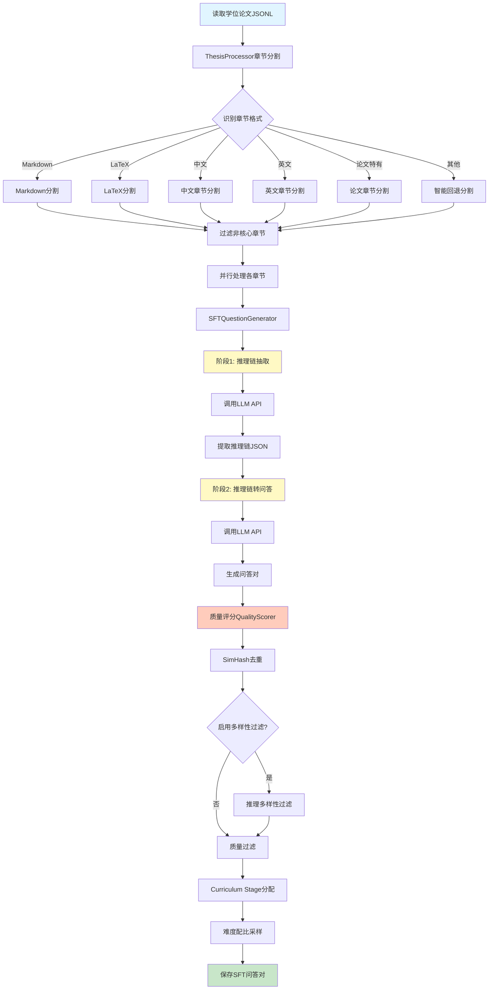
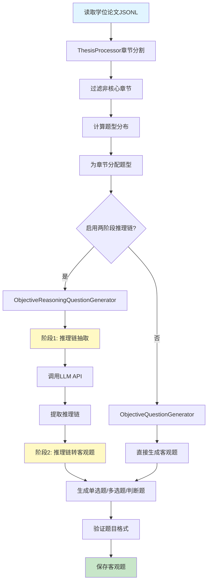
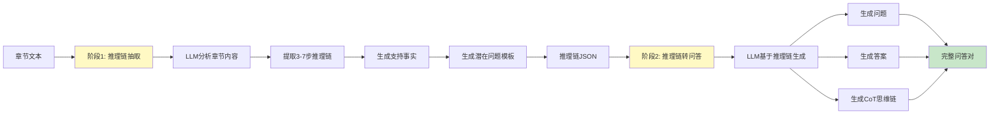
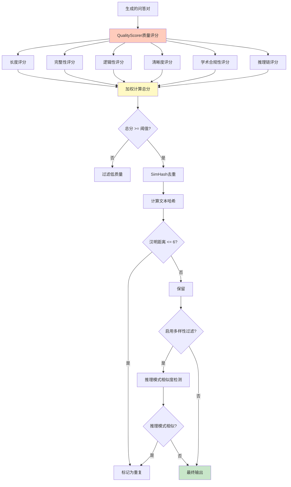
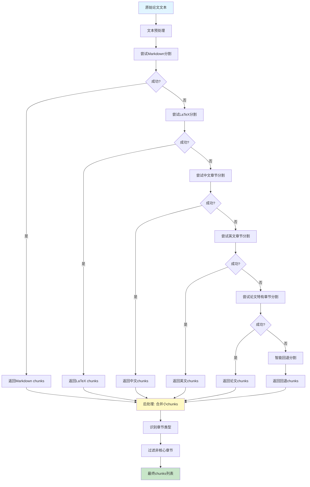

# 学位论文SFT问答对生成器

## 项目简介

`demo_thesis_QA_genrator_v2.py` 是一个专门针对学位论文的SFT（Supervised Fine-Tuning）问答对生成器。该工具能够自动读取学位论文文本，按章节拆分，并生成高质量的问答对，适用于大模型SFT训练。

## 系统流程图

### SFT问答对生成流程



### 客观题生成流程



### 两阶段推理链生成详细流程



### 质量评估与过滤流程



### 章节分割策略流程



## 核心特性

### 📚 学位论文优化
- 识别学位论文特有章节（摘要、引言、文献综述、方法、结果、讨论、结论）
- 增强学术性内容处理
- 优化实验结果和讨论部分的推理链生成
- 支持图表和公式的语义处理

### 🔗 推理链生成
- **两阶段推理链生成**：先生成推理过程，再生成答案
- **Thinking模式**：支持内部思考过程生成
- **推理多样性过滤**（可选）：避免相似推理路径

### 🎯 多种题目类型
- **SFT问答对**：适用于监督微调的标准问答格式
- **客观评测题**：
  - 单选题（200题）
  - 多选题（100题）
  - 判断题（100题）

### ✨ 质量控制
- **自动质量评分**：对生成的问答对进行质量评估
- **质量过滤**：可设置最低质量阈值过滤低质量内容
- **去重机制**：使用SimHash算法进行相似内容去重

### ⚡ 高性能
- **并行处理**：支持多线程并发处理
- **缓存机制**：章节分割结果缓存，提升效率
- **成本统计**：实时监控Token使用量和成本

## 安装依赖

```bash
# 使用 uv 安装依赖（推荐）
uv sync

# 或使用 pip
pip install openai python-dotenv

# 可选依赖
pip install tqdm  # 进度条显示
pip install reasoning_diversity  # 推理多样性过滤
```

## 环境配置

创建 `.env` 文件并配置以下环境变量：

```bash
# 必需配置
OPENAI_API_KEY=${OPENAI_API_KEY}

# 可选配置
OPENAI_BASE_URL=https://api.openai.com/v1  # 默认值
DEFAULT_MODEL=gpt-4o-mini  # 默认模型
```

## 使用方法

### 使用示例数据快速测试

```bash
uv run python demo_thesis_QA_genrator_v2.py \
    --input examples/sample_thesis.jsonl \
    --output output/
```

### 基本用法

```bash
python demo_thesis_QA_genrator_v2.py \
    --input data/thesis.jsonl \
    --output output/sft_qa.jsonl \
    --max-q-per-chunk 5 \
    --workers-thesis 4 \
    --workers-chunk 10
```

### 生成客观评测题

```bash
python demo_thesis_QA_genrator_v2.py \
    --input data/thesis.jsonl \
    --output output/objective_qa \
    --mode objective \
    --workers-thesis 6
```

### 启用质量过滤

```bash
python demo_thesis_QA_genrator_v2.py \
    --input data/thesis.jsonl \
    --output output/sft_qa.jsonl \
    --enable-quality-filter \
    --min-quality-score 70.0
```

### 启用推理多样性过滤

```bash
python demo_thesis_QA_genrator_v2.py \
    --input data/thesis.jsonl \
    --output output/sft_qa.jsonl \
    --enable-diversity-filter \
    --simhash-dedup-hamming 6
```

## 命令行参数

### 基础参数

| 参数 | 类型 | 默认值 | 说明 |
|------|------|--------|------|
| `--input` | string | - | **必需**。输入的学位论文JSONL文件路径 |
| `--output` | string | - | **必需**。输出文件路径或目录 |
| `--model` | string | gpt-4o-mini | 使用的模型名称 |
| `--max-q-per-chunk` | int | 5 | 每个chunk生成的最大问题数 |
| `--qa-per-chunk` | int | 5 | 每个章节生成的问题数（推荐使用此参数） |

### 模式选择

| 参数 | 说明 |
|------|------|
| `--mode sft` | 生成SFT问答对（默认模式） |
| `--mode objective` | 生成客观评测题 |

### 并行处理

| 参数 | 默认值 | 说明 |
|------|--------|------|
| `--workers-thesis` | 6 | 并行处理的论文数量 |
| `--workers-chunk` | 10 | 每篇论文并行处理的章节数量 |

### 质量控制

| 参数 | 默认值 | 说明 |
|------|--------|------|
| `--enable-quality-filter` | False | 启用质量过滤 |
| `--min-quality-score` | 70.0 | 最低质量分数阈值 |
| `--enable-diversity-filter` | False | 启用推理多样性过滤 |
| `--simhash-dedup-hamming` | 6 | SimHash去重的汉明距离阈值 |

### 上下文设置

| 参数 | 默认值 | 说明 |
|------|--------|------|
| `--context-length` | 10000 | 上下文长度限制 |
| `--qa-floor` | 80 | 每篇论文生成QA的最小数量 |
| `--qa-cap` | 120 | 每篇论文生成QA的最大数量 |

### Thinking模式

| 参数 | 说明 |
|------|------|
| `--enable-thinking` | 启用Thinking模式（默认开启） |
| `--no-thinking` | 禁用Thinking模式 |
| `--enable-api-thinking-objective` | 客观题模式启用Thinking模式（默认开启） |
| `--no-api-thinking-objective` | 客观题模式禁用Thinking模式 |
| `--enable-prompt-reasoning-objective` | 客观题模式启用两阶段推理链（默认关闭） |
| `--no-prompt-reasoning-objective` | 客观题模式禁用两阶段推理链 |

### 成本统计

| 参数 | 默认值 | 说明 |
|------|--------|------|
| `--input-price` | 1.2500 | 输入token价格（$/百万tokens） |
| `--output-price` | 10.0000 | 输出token价格（$/百万tokens） |

## 输入格式

输入文件应为JSONL格式，每行包含一篇学位论文：

```json
{
  "id": "thesis_001",
  "text": "学位论文全文内容...",
  "source": "proquest_papers"
}
```

或使用简化格式：

```json
{
  "id": "thesis_001",
  "text": "学位论文全文内容...",
  "label": "proquest_papers"
}
```

## 输出格式

### SFT问答对格式

```json
{
  "question_id": "q_001",
  "chunk_id": "chunk_001",
  "chunk_title": "第一章 引言",
  "question": "研究背景是什么？",
  "answer": "研究背景是...",
  "context": "上下文内容...",
  "reasoning_chain": "推理过程...",
  "question_type": "open_ended",
  "source_id": "chunk_001",
  "metadata": {
    "quality_score": 85.0,
    "reasoning_diversity_score": 0.92
  }
}
```

### 客观题格式

```json
{
  "question_id": "obj_001",
  "question_type": "single_choice",
  "question": "以下哪个是机器学习的主要特点？",
  "options": ["A. 基于规则", "B. 数据驱动", "C. 人工编程", "D. 固定逻辑"],
  "answer": "B",
  "explanation": "机器学习是一种数据驱动的方法...",
  "reasoning_chain": "推理过程...",
  "context": "上下文内容...",
  "chunk_id": "chunk_001",
  "chunk_title": "第一章 引言"
}
```

## 核心类说明

### 1. ThesisProcessor
负责学位论文的章节分割和预处理。
- 支持Markdown、LaTeX、中英文等多种格式的章节识别
- 智能过滤参考文献、致谢、附录等非核心章节
- 提供缓存机制提升处理效率

### 2. SFTQuestionGenerator
生成SFT问答对的主要类。
- 基于论文内容生成开放式问答
- 支持两阶段推理链生成
- 提供推理多样性过滤

### 3. ObjectiveQuestionGenerator
专门生成客观评测题的类。
- 生成单选、多选、判断三种题型
- 支持Thinking模式和两阶段推理链
- 自动生成选项和解释

### 4. QualityScorer
质量评分器。
- 对生成的问答对进行多维度评分
- 支持质量过滤机制
- 提供评分标准可配置

### 5. ObjectiveReasoningQuestionGenerator
客观推理题生成器。
- 专门生成需要推理的客观题
- 结合论文内容和推理能力测试

## 性能优化

### 并行处理策略
- **论文级别并行**：同时处理多篇论文
- **章节级别并行**：每篇论文内并行处理多个章节
- **线程池管理**：使用ThreadPoolExecutor管理资源

### 缓存机制
- 章节分割结果缓存（最多100条）
- MD5哈希验证缓存有效性
- 自动清理过期缓存

### 去重策略
- **SimHash算法**：高效检测相似内容
- **汉明距离阈值**：可配置相似度判断标准
- **多维度去重**：问题、答案、推理链分别去重

## 成本估算

系统提供详细的Token使用统计和成本计算：

```
Token 使用统计
======================================
总API调用次数: 120
输入 tokens: 1,250,000
输出 tokens: 125,000
总 tokens: 1,375,000

成本统计
======================================
输入成本: $1.5625 (1.2500/百万tokens)
输出成本: $1.2500 (10.0000/百万tokens)
总成本: $2.8125
平均每条记录成本: $0.023438
```

## 日志输出

系统提供详细的日志记录，包括：
- 处理进度跟踪
- 错误和异常信息
- 性能统计指标
- 成本消耗详情

日志文件：`thesis_qa_generator.log`

## 最佳实践

### 1. 参数调优
- **QA数量控制**：合理设置`--qa-floor`和`--qa-cap`平衡数据量与质量
- **并行度设置**：根据机器性能调整`--workers-thesis`和`--workers-chunk`
- **上下文长度**：根据模型限制调整`--context-length`

### 2. 质量提升
- 启用`--enable-quality-filter`过滤低质量内容
- 使用`--enable-diversity-filter`提升推理多样性
- 根据需要调整`--min-quality-score`阈值

### 3. 成本控制
- 监控`--input-price`和`--output-price`设置
- 使用缓存机制避免重复处理
- 合理设置并行度避免过度调用API

### 4. 批量处理
- 使用目标ID过滤：`--target-ids thesis_001 thesis_002`
- 分批处理大规模数据
- 定期保存中间结果

## 常见问题

### Q: 如何提高问答质量？
A: 启用质量过滤（`--enable-quality-filter`），提高质量阈值（`--min-quality-score`），并启用推理多样性过滤。

### Q: 如何减少生成时间？
A: 增加并行线程数（`--workers-thesis`和`--workers-chunk`），但注意API速率限制。

### Q: 如何控制成本？
A: 监控Token使用量，使用更经济的模型（如gpt-4o-mini），并启用缓存机制。

### Q: 支持哪些论文格式？
A: 支持Markdown、LaTeX、中英文等多种格式的学位论文，系统会自动识别章节结构。

### Q: 生成的问答对如何用于SFT训练？
A: 输出格式符合SFT训练标准，可直接用于OpenAI、Anthropic等平台的fine-tuning。

## 版本信息

- **当前版本**：v2.0 (v1.4)
- **作者**：Claude Code
- **更新日期**：2025-01-22

## 许可证

本项目遵循MIT许可证。

## 贡献

欢迎提交Issue和Pull Request来改进项目。

## 联系方式

如有问题，请通过GitHub Issues联系。
