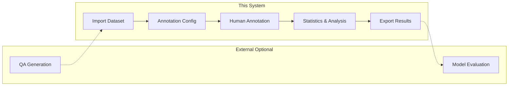

# QA Annotation System

The **Expert Validation Platform** in [QALoop](https://github.com/JackKuo666/QALoop) — a human-in-the-loop framework for large-scale agricultural QA construction and evaluation (ICDM). This web application supports **collaborative QA annotation and quality management**: multi-user task workflows, configurable annotation schemas, statistics and export, plus optional **LLM-assisted review of annotation notes**. It receives candidate QA pairs from upstream synthesis pipelines and converts expert judgments into structured feedback for pipeline iteration.

## Demo Usage

This Space is a demo environment — **works out of the box with no manual Secrets configuration**.

### Login

When you open the Space page, the login form is **pre-filled** with the default admin credentials. Click "Login" to start exploring.

| Item | Default |
|------|---------|
| Admin username | `admin` |
| Admin password | `123456` |

### Quick Demo Flow

After login, sample projects and QA data are pre-loaded. You can:

1. **Browse projects / datasets** — View the pre-loaded "Test" project and QA pairs in the admin dashboard
2. **View annotation configs** — Explore existing rating, single-select, and other annotation dimensions
3. **Claim and annotate** — Switch to the user center to complete tasks
4. **View analysis / export** — Check annotation progress, LLM analysis reports, and export results

To build from scratch, you can also create projects, configure schemas, and import JSON / CSV data yourself.

### Demo Sample Data (`seed/demo.sql`)

On first HF Space startup with an empty database, `scripts/space_init.py` automatically imports `seed/demo.sql` (SQLite text dump, git-friendly; HF does not accept binary `.db` files).

| Item | Details |
|------|---------|
| Pre-loaded content | 1 project, 3 datasets, 50 QA pairs, annotation configs, and sample annotation results |
| LLM config | Pre-filled Base URL and `gpt-5.1`; API Key injected via `LLM_API_KEY` env var, **not written to sql** |
| Runtime data | After import, written to `/data/annotations.db` inside the container; web UI changes only affect the runtime DB |
| Relation to sql | **Web UI actions do not write back to `demo.sql`**; updating Demo data requires manual export and push |

Example for updating Demo data:

```bash
# Export from local runtime DB (remember to redact llm_api_key)
sqlite3 ../data/annotations.db ".dump" > seed/demo.sql
git add seed/demo.sql && git commit -m "Update demo seed" && git push space main
```

To disable auto-import: set environment variable `SEED_DEMO_DATA=false`.

### Registering Regular Users

Currently in `production` mode: new users can self-register, but must be **manually enabled** by an admin in "User Management" before they can annotate.

### Demo Default Configuration

| Setting | Default | Description |
|---------|---------|-------------|
| `SECRET_KEY` | `qaloop-demo-jwt-secret-key-32bytes` | JWT signing key (Demo only, do not use in production) |
| `ADMIN_USERNAME` | `admin` | Admin auto-created on first startup |
| `ADMIN_PASSWORD` | `123456` | Admin password |
| `DB_DIR` | `/data` | Database storage directory |
| `ENVIRONMENT` | `production` | New registrations require admin enablement |

> **Security note**: The above are public Demo settings. Do not store real sensitive data. For production deployment, override `SECRET_KEY` and `ADMIN_PASSWORD` via HF Secrets.

## Deploy to Hugging Face Spaces

1. Create a Space on [Hugging Face](https://huggingface.co/new-space), SDK type **Docker**
2. Push the contents of `platform/` to the Space repository (you can upload only the platform subdirectory as the repo root)
3. **No Secrets needed for Demo** — build and run directly
4. For production deployment, override in Space **Settings → Repository secrets**:

| Secret | Demo Default | Description |
|--------|--------------|-------------|
| `SECRET_KEY` | `qaloop-demo-jwt-secret-key-32bytes` | JWT key; use a random string in production |
| `ADMIN_USERNAME` | `admin` | Admin username auto-created on first startup |
| `ADMIN_PASSWORD` | `123456` | Admin password (at least 6 characters) |

5. Optional **Variables**:

| Variable | Default | Description |
|----------|---------|-------------|
| `DB_DIR` | `/data` | SQLite data directory (Dockerfile defaults to `/data`) |
| `ENVIRONMENT` | `production` | New registrations require admin enablement |
| `LLM_BASE_URL` | `http://43.159.131.233:3001/v1` | LLM API Base URL (OpenAI-compatible) |
| `LLM_MODEL_NAME` | `gpt-5.1` | LLM model name |

6. **LLM Analysis (optional)**: Set in Space **Settings → Repository secrets**:

| Secret | Description |
|--------|-------------|
| `LLM_API_KEY` | LLM API Token (auto-written to system config on startup) |

Demo pre-fills Base URL and model name for OpenAI-compatible calls:

```python
from openai import OpenAI

client = OpenAI(
    base_url="http://43.159.131.233:3001/v1",
    api_key="your-token",  # Set LLM_API_KEY in HF Secrets
)
# model: gpt-5.1
```

7. After the Space build completes, visit the page and log in with `admin` / `123456`

> **Note**: On free Spaces, annotation data may be lost after sleep/restart if persistent storage is not enabled. Fine for Demo purposes; for production collaborative annotation, deploy on your own server.

## Highlights

- **Projects and datasets** — Project-level organization with JSON / CSV import and export
- **Flexible annotation configs** — Rating, category, text, single/multi-select, binary; optional reason and confidence fields
- **Collaboration and permissions** — Superuser admin dashboard; regular users claim tasks and annotate; JWT auth
- **Analysis and export** — Annotation progress and statistics; configurable simplified export
- **Optional LLM** — OpenAI-compatible Chat API, default `http://43.159.131.233:3001/v1` + `gpt-5.1`; Token injected via `LLM_API_KEY` env var
- **Seed questions** — Predefined question templates organized by type/subtype
- **UI language** — Chinese and English (i18n)

## System Overview


The diagram above shows the full QALoop workflow. This platform corresponds to the **Expert Validation Platform** stage — receiving candidate QA pairs from upstream synthesis pipelines and supporting human quality review, feedback, and export.

This repository covers **data import → schema configuration → multi-user annotation → statistics/analysis → export**. It does not include built-in "automatic QA generation" or "automatic model scoring/evaluation" modules; these can be integrated via upstream/downstream systems.



## Configurable Schema Example

Annotation dimensions and field names are defined by admins in **Annotation Config**, not hardcoded in the product. If your research uses multi-dimensional quality scales (e.g., factuality, completeness), implement them via multiple `score` / `category` configs. Below is an **illustrative JSON** (actual export structure depends on your config):

```json
{
  "question": "What is drought resistance?",
  "answer": "Drought resistance refers to a plant's ability to maintain growth and yield under drought conditions.",
  "annotations": {
    "factuality_score": 5,
    "completeness_score": 4,
    "notes": "Correct explanation but could add mechanistic details"
  }
}
```

## Tech Stack

- **Backend**: Python 3.12+ / FastAPI / SQLAlchemy / SQLite
- **Frontend**: Vanilla HTML + JS + CSS (no framework)
- **Auth**: JWT (SHA-256 client-side hashing)
- **Package manager**: uv

## Requirements

- Python >= 3.12
- [uv](https://docs.astral.sh/uv/) (Python package manager)

## Quick Start

### 1. Clone the Repository

```bash
git clone <repo-url>
cd qa-annotation
```

### 2. Install Dependencies

```bash
# Install uv (if not already installed)
curl -LsSf https://astral.sh/uv/install.sh | sh

# Create virtual environment and install all dependencies
uv sync

# For dev tools (pre-commit, etc.)
uv sync --group dev
```

### 3. Configure Environment Variables

Create a `.env` file:

```bash
cp .env.example .env
```

Then edit `.env` and **must update `SECRET_KEY`**:

```ini
# Required
SECRET_KEY=your-random-secret-key-here

# Optional (defaults below)
ENVIRONMENT=development
HOST=0.0.0.0
PORT=8000
RELOAD=false
TOKEN_EXPIRE_DAYS=7
```

| Variable | Required | Description | Default |
|----------|----------|-------------|---------|
| `SECRET_KEY` | Yes | JWT key; must be a random string in production | - |
| `ENVIRONMENT` | No | `development` or `production` | `development` |
| `HOST` | No | Listen address | `0.0.0.0` |
| `PORT` | No | Listen port | `8000` |
| `RELOAD` | No | Enable hot reload (for development) | `false` |
| `TOKEN_EXPIRE_DAYS` | No | Token expiration in days | `7` |

> In production, newly registered users are disabled by default and require manual admin enablement.

### 4. Create Superuser

```bash
# Interactive creation (recommended)
python scripts/create_superuser.py

# Create via command-line arguments
python scripts/create_superuser.py --username admin --password yourpassword
```

### 5. Start the Server

```bash
# Option 1: Direct run
uvicorn qa_annotate.main:app --reload --host 0.0.0.0 --port 8000

# Option 2: Via entry point (requires uv sync first)
qa
```

After startup, visit `http://localhost:8000` and log in with the superuser account. API docs: `http://localhost:8000/docs`.

## User Guide

### Admin Workflow

1. **Login** — Log in with superuser account, enter admin dashboard
2. **Create project** — Set name and description
3. **Create annotation config** — Define task type (rating, category, text, single-select, multi-select, binary), and whether reason/confidence fields are required
4. **Link config to project** — Associate annotation configs with projects, with ordering support
5. **Import dataset** — Upload QA data in JSON or CSV format
6. **Manage users** — Create/enable/disable annotator accounts
7. **Configure LLM (optional)** — Fill in the following keys in "System Config" (stored in database, **not** `.env`):

   | Config Key | Description |
   |------------|-------------|
   | `llm_api_key` | LLM API Key |
   | `llm_base_url` | Base URL (e.g., `https://api.openai.com/v1`) |
   | `llm_model_name` | Model name (e.g., `gpt-4o`) |

   Use "Test Connection" to verify. Current implementation is mainly for **summarizing and analyzing annotation notes**; core annotation works without LLM config.

8. **View analysis** — Annotation progress, statistics, and (if configured) LLM analysis reports

### Annotator Workflow

1. **Register/Login** — In development, registered users can usually annotate immediately; in production, admin must enable the account
2. **Claim task** — Claim a dataset from "Available Tasks"
3. **Annotate** — Fill in fields according to config
4. **My tasks** — View and track progress

### Permissions (Summary)

| Capability | Superuser | Regular User |
|------------|-----------|--------------|
| Admin dashboard (projects, datasets, users, system config, etc.) | Yes | No |
| Claim tasks and submit annotations | Yes | Yes (must be enabled) |

Superusers also have an active regular user identity and can participate in annotation when needed.

### Data Format

**Import QA dataset (JSON)**:

```json
[
  {
    "question": "Question content",
    "answer": "Answer content"
  }
]
```

Extra fields are supported; specify which extra fields to display in project config.

## Project Structure

```
qa_annotate/
├── api/               # FastAPI router modules
│   ├── analysis.py    # Annotation result analysis and LLM endpoints
│   ├── annotation.py  # Annotation configs and results
│   ├── auth.py        # Authentication and permissions
│   ├── dataset.py     # Dataset management
│   ├── project.py     # Project management
│   ├── seed_question.py  # Seed questions
│   ├── system_config.py  # System configuration
│   └── user.py        # User management
├── database/          # Database layer
│   ├── base.py        # Engine, session, initialization
│   ├── models.py      # SQLAlchemy ORM models
│   └── crud.py        # CRUD operations
├── schema/            # Pydantic request/response models
├── services/          # Business services (e.g., LLM calls)
├── utils/             # Utilities (password hashing, etc.)
├── config.py          # Global config (pydantic-settings)
├── html/              # HTML pages
├── static/
│   ├── js/            # JavaScript
│   ├── css/           # Stylesheets
│   └── locales/       # i18n translation files
└── main.py            # Application entry point
```

## Database Backup

```bash
# Manual backup
python scripts/backup_db.py

# Scheduled backup (every 12 hours)
python scripts/backup_db.py --schedule --interval 12
```

## Development

```bash
# Install dev dependencies
uv sync --group dev

# Install pre-commit hooks
pre-commit install

# Lint and format
ruff check --fix .
ruff format .
```

## Research and Citation

This platform is the **Expert Validation Platform** component of QALoop. If you use it in a publication, please cite the QALoop ICDM paper and describe **annotation dimensions and guideline version**, **export format and field meanings**. See the [root README](https://github.com/JackKuo666/QALoop#citation) for BibTeX.

## Roadmap

- Inter-annotator agreement (IAA) metrics and adjudication tools
- Active learning or priority queue (integrated with task claiming)
- Richer chain-of-thought / multi-segment annotation display (extend Schema and UI as needed)
- Multimodal field display (if datasets include image URLs, etc.)

## License

MIT
