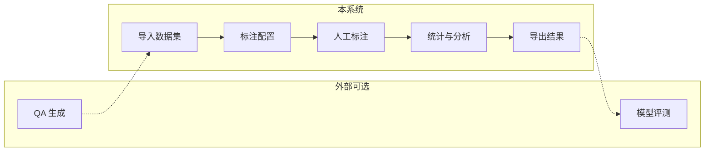

# QA Annotation System

面向 **问答（QA）数据协作标注与质量管理** 的 Web 应用：多用户任务流、可配置的标注量表（Schema）、统计与导出，以及可选的 **LLM 辅助阅读标注备注**。适合作为数据构建流水线中的「人工标注与质检」环节，与外部的 QA 生成、模型评测等工具链组合使用。

## 要点

- **项目与数据集** — 项目级组织，支持 JSON / CSV 导入与导出
- **灵活标注配置** — 评分、分类、文本、单选/多选、二元；可选理由与置信度字段
- **协作与权限** — 超级用户管理后台；普通用户领取任务并标注；JWT 认证
- **分析与导出** — 标注进度与统计分析；结果可按配置简化导出
- **可选 LLM** — OpenAI 兼容 Chat API，对项目内标注备注生成分析报告（需系统配置，非 `.env`）
- **种子问题** — 预置问题模板，按类型/子类管理
- **界面语言** — 中英文（i18n）

## 系统概览

本仓库覆盖 **数据导入 → 配置量表 → 多人标注 → 统计/分析 → 导出**；不包含内置的「自动 QA 生成」或「模型自动打分评测」模块，二者可通过上游/下游系统接入。



## 可配置量表示例

标注维度与字段名由管理员在 **标注配置** 中定义，而非产品写死。若研究与论文中采用多维质量量表（如事实性、完整性等），可通过多条 `score` / `category` 等配置实现。以下为 **示意 JSON**（导出结构以实际配置为准）：

```json
{
  "question": "什么是抗旱性状？",
  "answer": "抗旱性状是指植物在干旱条件下维持生长和产量的能力。",
  "annotations": {
    "factuality_score": 5,
    "completeness_score": 4,
    "notes": "解释正确但可补充机制层面细节"
  }
}
```

## 技术栈

- **后端**: Python 3.12+ / FastAPI / SQLAlchemy / SQLite
- **前端**: 原生 HTML + JS + CSS（无框架）
- **认证**: JWT（SHA-256 客户端哈希）
- **包管理**: uv

## 环境要求

- Python >= 3.12
- [uv](https://docs.astral.sh/uv/)（Python 包管理工具）

## 快速开始

### 1. 克隆项目

```bash
git clone <repo-url>
cd qa-annotation
```

### 2. 安装依赖

```bash
# 安装 uv（如果没有）
curl -LsSf https://astral.sh/uv/install.sh | sh

# 创建虚拟环境并安装所有依赖
uv sync

# 如需开发工具（pre-commit 等）
uv sync --group dev
```

### 3. 配置环境变量

创建 `.env` 文件：

```bash
cp .env.example .env
```

然后编辑 `.env`，**必须修改 `SECRET_KEY`**：

```ini
# 必填
SECRET_KEY=your-random-secret-key-here

# 可选（以下为默认值）
ENVIRONMENT=development
HOST=0.0.0.0
PORT=8000
RELOAD=false
TOKEN_EXPIRE_DAYS=7
```

| 变量 | 必填 | 说明 | 默认值 |
|------|------|------|--------|
| `SECRET_KEY` | 是 | JWT 密钥，生产环境务必修改为随机字符串 | - |
| `ENVIRONMENT` | 否 | `development` 或 `production` | `development` |
| `HOST` | 否 | 监听地址 | `0.0.0.0` |
| `PORT` | 否 | 监听端口 | `8000` |
| `RELOAD` | 否 | 是否启用热重载（开发用） | `false` |
| `TOKEN_EXPIRE_DAYS` | 否 | Token 过期天数 | `7` |

> 生产环境下新注册用户默认禁用，需管理员手动启用。

### 4. 创建超级用户

```bash
# 交互式创建（推荐）
python scripts/create_superuser.py

# 通过命令行参数创建
python scripts/create_superuser.py --username admin --password yourpassword
```

### 5. 启动服务

```bash
# 方式一：直接运行
uvicorn qa_annotate.main:app --reload --host 0.0.0.0 --port 8000

# 方式二：通过入口点（需要先 uv sync）
qa
```

启动后访问 `http://localhost:8000`，使用超级用户账号登录。API 文档：`http://localhost:8000/docs`。

## 使用指南

### 管理员工作流

1. **登录** — 使用超级用户账号登录，进入管理后台
2. **创建项目** — 设置名称和描述
3. **创建标注配置** — 定义任务类型（评分、分类、文本、单选、多选、二元），以及是否要求理由/置信度
4. **关联配置到项目** — 将标注配置关联到项目，支持排序
5. **导入数据集** — 上传 JSON 或 CSV 格式的 QA 数据
6. **管理用户** — 创建/启用/禁用标注员账号
7. **配置 LLM（可选）** — 在「系统配置」中填写下列键值（存入数据库，**不是** `.env`）：

   | 配置键 | 说明 |
   |--------|------|
   | `llm_api_key` | LLM API Key |
   | `llm_base_url` | Base URL（如 `https://api.openai.com/v1`） |
   | `llm_model_name` | 模型名称（如 `gpt-4o`） |

   可使用「测试连接」验证。当前实现主要用于 **汇总分析标注备注**；不配置不影响核心标注功能。

8. **查看分析** — 标注进度、统计与（若已配置）LLM 分析报告

### 标注员工作流

1. **注册/登录** — 开发环境注册后通常可直接使用；生产环境需管理员启用账号
2. **领取任务** — 在「可用任务」中领取数据集
3. **执行标注** — 按配置填写各字段
4. **我的任务** — 查看与跟进进度

### 权限说明（概要）

| 能力 | 超级用户 | 普通用户 |
|------|----------|----------|
| 管理后台（项目、数据集、用户、系统配置等） | 是 | 否 |
| 领取任务并提交标注 | 是 | 是（需启用） |

超级用户同时具备普通用户的活跃身份，需要时也可参与标注。

### 数据格式

**导入 QA 数据集（JSON）**：

```json
[
  {
    "question": "问题内容",
    "answer": "回答内容"
  }
]
```

支持额外字段，可在项目配置中指定需要展示的 extra 字段。

## 项目结构

```
qa_annotate/
├── api/               # FastAPI 路由模块
│   ├── analysis.py    # 标注结果分析与 LLM 相关接口
│   ├── annotation.py  # 标注配置与结果
│   ├── auth.py        # 认证与权限
│   ├── dataset.py     # 数据集管理
│   ├── project.py     # 项目管理
│   ├── seed_question.py  # 种子问题
│   ├── system_config.py  # 系统配置
│   └── user.py        # 用户管理
├── database/          # 数据库层
│   ├── base.py        # 引擎、会话、初始化
│   ├── models.py      # SQLAlchemy ORM 模型
│   └── crud.py        # CRUD 操作
├── schema/            # Pydantic 请求/响应模型
├── services/          # 业务服务（如 LLM 调用）
├── utils/             # 工具函数（密码哈希等）
├── config.py          # 全局配置（pydantic-settings）
├── html/              # HTML 页面
├── static/
│   ├── js/            # JavaScript
│   ├── css/           # 样式表
│   └── locales/       # i18n 翻译文件
└── main.py            # 应用入口
```

## 数据库备份

```bash
# 手动备份
python scripts/backup_db.py

# 定期备份（每 12 小时）
python scripts/backup_db.py --schedule --interval 12
```

## 开发

```bash
# 安装开发依赖
uv sync --group dev

# 安装 pre-commit hooks
pre-commit install

# 代码检查与格式化
ruff check --fix .
ruff format .
```

## 研究与引用

若本系统或配套数据集用于发表论文，建议在文中说明：**标注维度与指南版本**、**导出格式与字段含义**，并在此补充论文标题、会议/期刊与 BibTeX（待发表时可先占位「即将更新」）。

## Roadmap（设想）

- 多标注员一致性指标（IAA）与对拍工具
- 主动学习或优先级队列（与任务领取结合）
- 更丰富的链式推理 / 多片段标注展示（视需求扩展 Schema 与 UI）
- 多模态字段展示（若数据集中包含图片等 URL）

## License

Private
